# Appium 环境搭建

>$ java -version    java version "1.8.0_231"  
>$ python -V      Python 3.7.8  
>$ node -v    v14.17.0  
>$ appium.cmd   Welcome to Appium v1.21.0

## 安装  

## JDK-安装 

### JDK-下载:  
http://www.oracle.com/technetwork/java/javase/downloads/jdk8-downloads-2133151.html  
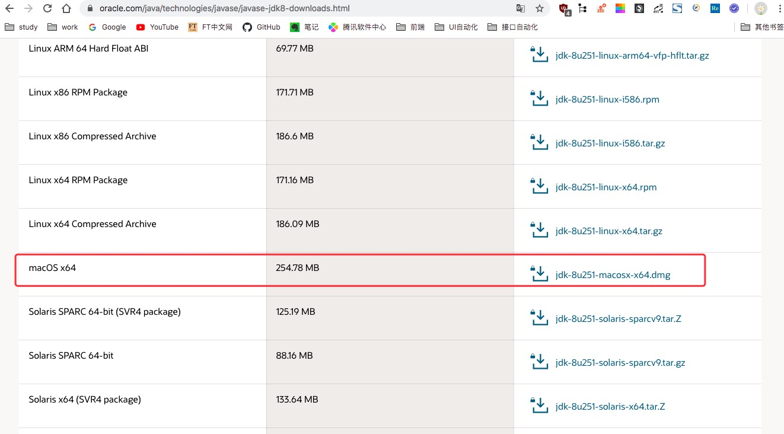

windows配置环境变量：  

  > JAVA_HOME  D:\dev_env\jdk1.8    
  > CLASSPATH  %JAVA_HOME%\lib\dt.jar；%JAVA_HOME%\lib\tools.jar；  
  > Path  %JAVA_HOME%\bin;%JAVA_HOME%\jre\bin  

    $ java -version
    java version "1.8.0_231"
    Java(TM) SE Runtime Environment (build 1.8.0_231-b11)
    Java HotSpot(TM) 64-Bit Server VM (build 25.231-b11, mixed mode)


***
2、SDK-安装 

官网下载：Android-sdk:https://www.androiddevtools.cn/  
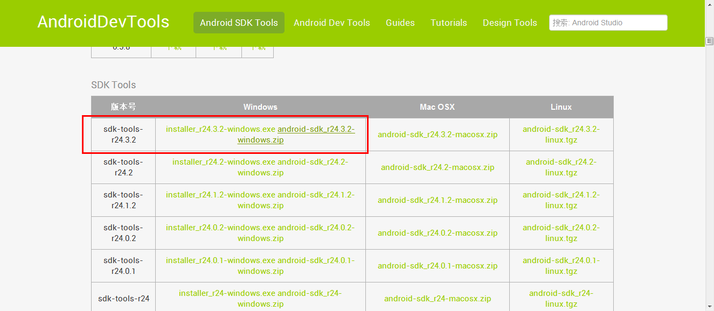  

下载完成后解压： 
> SDK顾名思义，Android SDK Manager就是一个Android软件开发工具包管理器，就像一个桥梁，连通本地和服务器，从服务器下载安卓开发所需工具到本地。  
>而AVD Manager是一个Android虚拟驱动管理器，主要用来创建安卓模拟器（即手机模拟器）。当然，安卓模拟器所需的镜像（可以理解成模拟器的操作系统）是通过SDK Manager来下载的。所以要想用模拟器，必须先使用SDK下载操作系统。  
>对于SDK Manager和AVD Manager的使用，还需要一个基础工具包tools提供支持。

windows配置环境变量： 

    ANDROID_HOME 系统变量为，如：D:\android-sdk\sdk
    Path %ANDROID_HOME%\platform-tools;%ANDROID_HOME%\tools

SDK Manager安装配置详解：https://www.cnblogs.com/du-hong/p/11003755.html或者https://www.cnblogs.com/yoyoketang/p/7189970.html 

SDK Manager安装配置:  
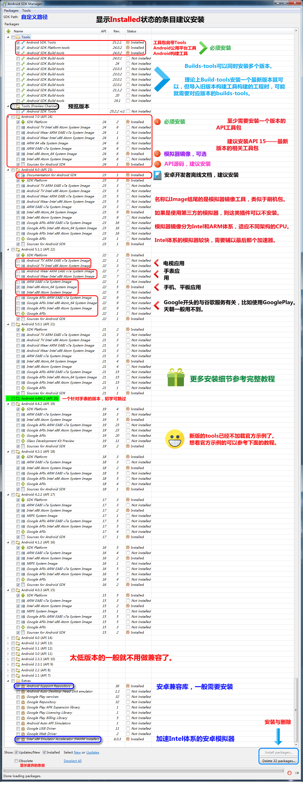

***
3、安装Node.js  

官网下载地址：https://nodejs.org/en/download/23,安装完成后，运行cmd，输入node –v查看版本号，然后输入npm

***
4、安装appium-desktop  
 
Appium官方网站：http://appium.io/ ,点击下载按钮会到GitHub的下载页面：https://github.com/appium/appium-desktop/releases/tag/v1.21.0，选择对应平台下载：  

安装完成后，启动Appium，host和port默认的即可，然后设置Android SDk和Java JDK  

然后点下边那个保存并重启的按钮，然后点第一个Start Server按钮，将会看到  


- 真机测试  

  * 1.连接手机

  打开开发者模式，USB线连接手机和电脑，并且在开发者选项当中，开启USB调试  

  测试是否连接成功，可执行命令adb devices  

  出现上图就证明手机和电脑连接成功。。。  

  * 2.点击Start Inspector Session   

   按如下配置Desired Capabilities  
   {
     "platformName": "Android",
     "platformVersion": "9",
     "deviceName": "mi11",
     "appPackage": "com.jm.android.jumei",
     "appActivity": "com.jm.android.jumei.home.activity.StartActivity",
     "resetKeyboard": "True"
   }
   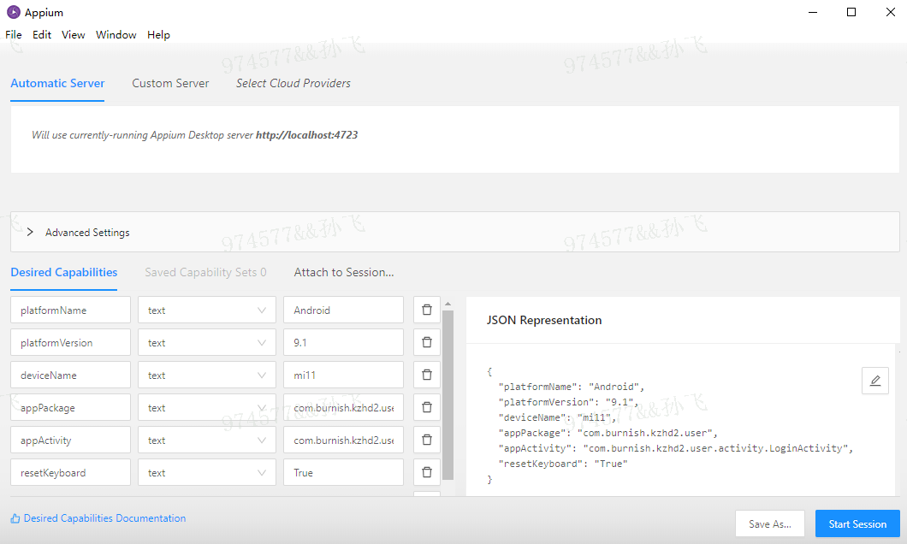

   platformName ：声明是ios还是Android系统    
   platformVersion： Android内核版本号，可通过命令adb shell getprop ro.build.version.release查看   
   deviceName ：连接的设备名称，通过命令 adb devices -l 中model查看  
   appPackage：apk的包名   
   appActivity：apk的launcherActivity，通过命令adb shell dumpsys activity | findstr “mResume”查看（需先打开手机应用）  

   注意：Android 8.1之前应使用adb shell dumpsys activity | findstr “mFocus”  

  * 3.运行Start Session，选择元素  

   右侧 Selected Element 区域有三个按钮  

   Tap：执行选中元素的点击事件  
   Send Keys：为文本框等对象传值  
   如果是文本输入元素，就清除文本   
   
  * 4.录制脚本
   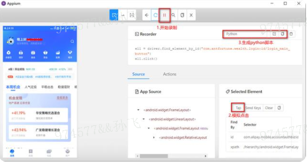
   录制生成的python代码如下：
   
   
  * 5.最后，记一个我在这些过程中遇到的问题（现已解决）

   在Appium-desktop中运行Start Session时，出现
   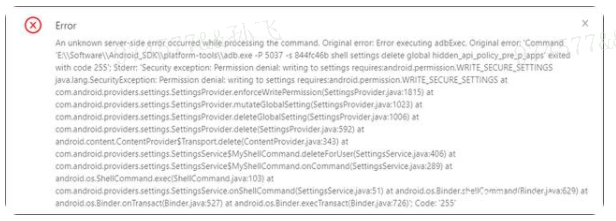
   解决方法:在开发者模式下，打开usb调试功能和use模拟点击，两个都要打开，此时再重新运行，即可解决

***
5、模拟器

***
6、python文件中安装Appium-Python-Client:pip install Appium-Python-Client

## 环境变量

```.bash
vi ~/.bash_profile

#android-jdk
export ANDROID_HOME=/usr/local/opt/android-sdk-macosx
export PATH=${PATH}:${ANDROID_HOME}/tools
export PATH=${PATH}:${ANDROID_HOME}/platform-tools

#java
JAVA_HOME=/Library/Java/JavaVirtualMachines/jdk1.8.0_251.jdk/Contents/Home
PATH=$PATH:$JAVA_HOME/bin
CLASSPATH=.:$JAVA_HOME/lib/dt.jar:$JAVA_HOME/lib/tools.jar
export JAVA_HOME PATH CLASSPATH

检查是否安装成功：
1.打开cmd验证是否安装成功，输入java -version，然后输入javac
2..在cmd输入adb可以查看对应版本号
```

PS:
uiautomatorviewer出现Unable to connect to adb. Check if adb is installed correctly解决方法：  
1.打开 uiautomatorviewer.bat，找到 uiautomatorviewer.bat 文件最后一行  
2.将其中的binddir=%prog_dir%修改为 SDK 的 platform-tools 所在路径（我的 SDK 路径为：/usr/local/opt/android-sdk-macosx/platform-tools）  
3."-Dcom.android.uiautomator.bindir=/usr/local/opt/android-sdk-macosx/platform-tools" -jar  


WARN AppiumDoctor  ✖ opencv4nodejs cannot be found.  
1、CMake下载安装
  下载 https://cmake.org/download/  
  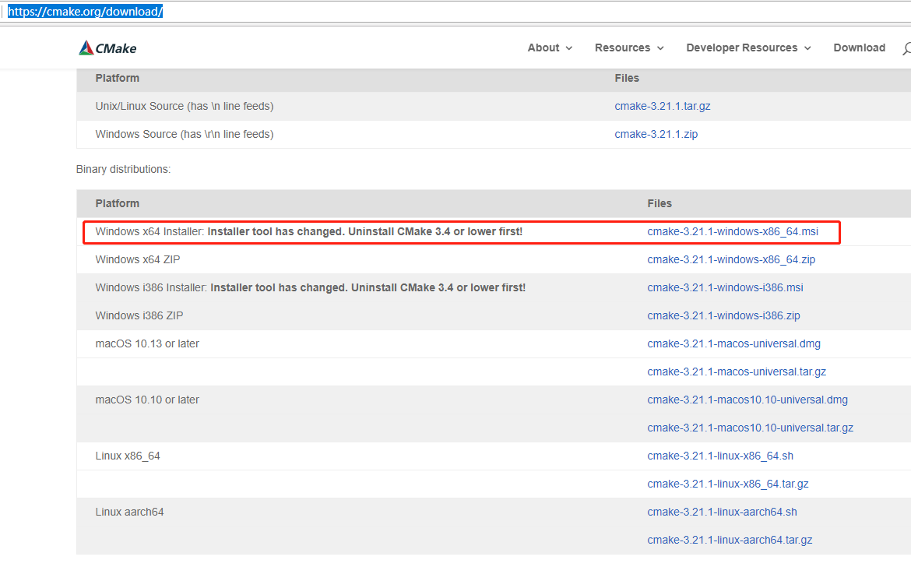
  安装验证
  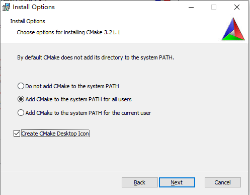
  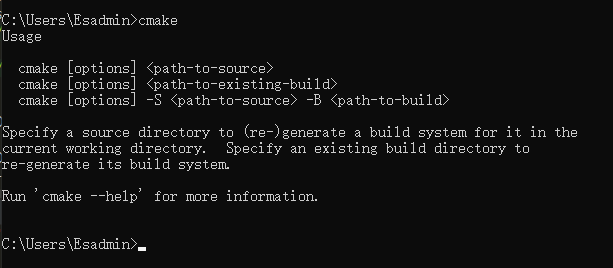
2、Opencv下载安装  
  npm install -g opencv4nodejs --ignore-scripts  
  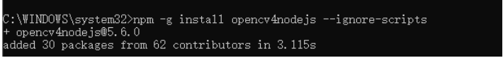
  

WARN AppiumDoctor  ✖ ffmpeg cannot be found.  
到ffmpeg官网https://ffmpeg.org/download.html    
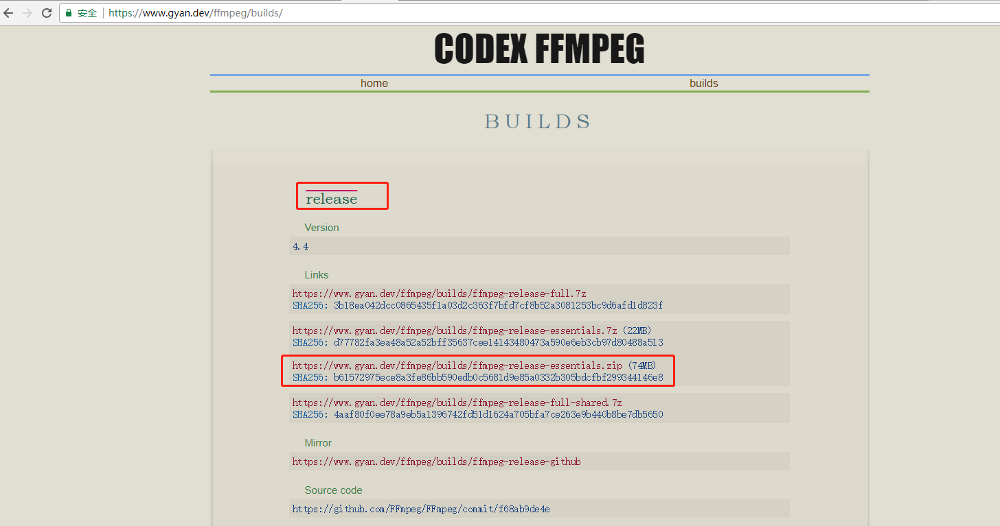

下载解压后配置环境变量
D:\tools\ffmpeg-4.4-essentials_build\bin
验证：ffmpeg  –version检查


WARN AppiumDoctor  ✖ mjpeg-consumer cannot be found.  
安装：npm i -g mjpeg-consumer  

WARN AppiumDoctor  ✖ bundletool.jar cannot be found  
在https://github.com/google/bundletool/releases 下载bundletool.jar，  
在你的安卓SDK下新建一个bundle-tool文件夹，然后将这个jar包改名成这个bundletool(.jar后缀名保留)放在bundle-tool文件夹下  
系统环境变量 PATHEXT 追加 ;.JAR 即可  

WARN AppiumDoctor  ✖ gst-launch-1.0.exe and/or gst-inspect-1.0.exe cannot be found.    
安装： 1、下载：https://gstreamer.freedesktop.org/download/  
      2、runtime installer 和 development installer 两个应用程序都要下载并安装。  
      3、配置Path系统环境变量E:\gstreamer\1.0\mingw_x86_64\bin  


Appium（如果不需要客户端可以直接安装：npm install -g appium）
npm install -g appium-doctor

添加环境变量：C:\Users\Esadmin\AppData\Roaming\npm
cmd: appium.cmd
cmd: appium.cmd -a 127.0.0.1 -p 4723 --session-override
