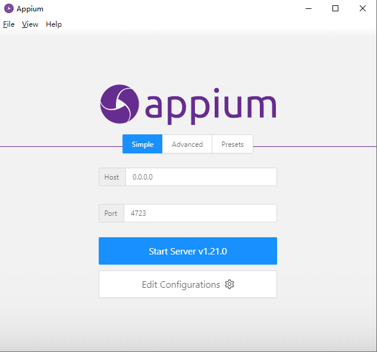
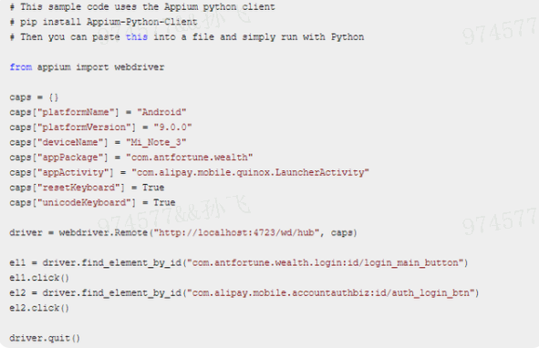

# Appium 环境搭建

> $ java -version   
    java version "1.8.0_231" 
     
> $ python -V      
    Python 3.7.8  
    
> $ node -v    
    v14.17.0  
     
> $ appium.cmd   
    [Appium] Welcome to Appium v1.21.0  
    [Appium] Appium REST http interface listener started on 0.0.0.0:4723  

## JDK-安装 
### JDK-下载:  
http://www.oracle.com/technetwork/java/javase/downloads/jdk8-downloads-2133151.html 
 

### windows配置环境变量：  

  > JAVA_HOME  D:\dev_env\jdk1.8    
  > CLASSPATH  %JAVA_HOME%\lib\dt.jar；%JAVA_HOME%\lib\tools.jar；  
  > Path  %JAVA_HOME%\bin;%JAVA_HOME%\jre\bin  

    $ java -version
    java version "1.8.0_231"
    Java(TM) SE Runtime Environment (build 1.8.0_231-b11)
    Java HotSpot(TM) 64-Bit Server VM (build 25.231-b11, mixed mode)

***
## SDK-安装 
### JDK-下载：
官网下载：Android-sdk:https://www.androiddevtools.cn/  
  
  

* 下载完成后解压： 

 > SDK顾名思义，Android SDK Manager就是一个Android软件开发工具包管理器，就像一个桥梁，连通本地和服务器，从服务器下载安卓开发所需工具到本地。  
 >而AVD Manager是一个Android虚拟驱动管理器，主要用来创建安卓模拟器（即手机模拟器）。当然，安卓模拟器所需的镜像（可以理解成模拟器的操作系统）是通过SDK Manager来下载的。所以要想用模拟器，必须先使用SDK下载操作系统。  
 >对于SDK Manager和AVD Manager的使用，还需要一个基础工具包tools提供支持。

### windows配置环境变量： 

   > ANDROID_HOME D:\android-sdk\sdk  
   > Path %ANDROID_HOME%\platform-tools;%ANDROID_HOME%\tools  

   SDK Manager安装配置详解：  
   https://www.cnblogs.com/du-hong/p/11003755.html  
   或者https://www.cnblogs.com/yoyoketang/p/7189970.html   

### SDK Manager安装配置:  

***
## Node.js-安装  

### Node.js-下载： 
 官网下载地址：https://nodejs.org/en/download/23  
 release下载：https://nodejs.org/dist/  
 安装完成后，运行cmd，输入node –v查看版本号，然后输入npm
 
 安装node.js的目的是为了使用它自动的npm安装appium，但是npm安装比较慢经常出问题，建议使用cnpm安装：  

 > npm install -g cnpm --registry=https://registry.npm.taobao.org

    $ node -v    
      v14.17.0  
    $ npm -version
      6.14.13

***
## Appium-desktop-安装 

### 桌面安装

 下载 Appium 地址:http://appium.io/  
 点击下载按钮会到GitHub的下载页面：https://github.com/appium/appium-desktop/releases/tag/v1.21.0，   
 选择对应平台下载：  

 先别着急点击start server启动，先点击Edit Configurations配置下：  
 检查下两个环境变量配置是否与你自己主机的真实地址对应，是的话就点击save and restart即可。  
   

 点击“Start Server v1.21.0”启动服务：  
 
 

### 命令行安装Appium
#### 安装appium    
 
 方式1：推荐  
  
    $ cnpm install -g appium@1.21.0 --registry=https://registry.npm.taobao.org   

 方式2：
 
    $ cnpm install -g appium@1.21.0 --registry=https://registry.cnpmjs.org 

 方式3：
 
    $ cnpm install -g appium –no-cache
 
 方法4：
 
    $ npm install -g appium
 
 
   添加环境变量：C:\Users\Esadmin\AppData\Roaming\npm  
   查看appium版本：appium.cmd –v  
   启动appium服务：appium.cmd -a 127.0.0.1 -p 4723 --session-override  
   停止appium服务：ctrl+c，输入y回车即可  
    
    $ where appium
    D:\tools\Appium-windows-1.21.0\Appium.exe
    C:\Users\Esadmin\AppData\Roaming\npm\appium
    C:\Users\Esadmin\AppData\Roaming\npm\appium.cmd
    
    $ appium.cmd –v
    1.21.0
    
    $ appium.cmd 
    [Appium] Welcome to Appium v1.21.0
    [Appium] Appium REST http interface listener started on 0.0.0.0:4723
    
    $ appium.cmd -a 127.0.0.1 -p 4723 --session-override
    [Appium] Welcome to Appium v1.21.0
    [Appium] Non-default server args:
    [Appium]   address: 127.0.0.1
    [Appium]   sessionOverride: true
    [Appium] Appium REST http interface listener started on 127.0.0.1:4723
    
#### 安装Appium-Python-Client(必须安装)  
    
    $ pip install Appium-Python-Client
 
#### 安装appium-doctor:  
 
 方式1:  

    $ npm install -g appium-doctor
 
 方式2：  
   
    $ cnpm install -g appium-doctor@1.6.0
 
 检查appium是否安装成功：    
 
    $ appium-doctor
 
 安装过程出现的问题： 
 
 > WARN AppiumDoctor  ✖ opencv4nodejs cannot be found.    
 > WARN AppiumDoctor  ✖ ffmpeg cannot be found.   
 > WARN AppiumDoctor  ✖ mjpeg-consumer cannot be found.  
 > WARN AppiumDoctor  ✖ bundletool.jar cannot be found.
 > WARN AppiumDoctor  ✖ gst-launch-1.0.exe and/or gst-inspect-1.0.exe cannot be found.     
 
 - 解决：WARN AppiumDoctor  ✖ opencv4nodejs cannot be found.
    
 1.1 CMake 安装,下载: https://cmake.org/download/  
    
  
 1.2 安装验证 
    
  
    
 2.Opencv 命令行安装  
  
    $ npm install -g opencv4nodejs --ignore-scripts  
    
  
 
 - 解决：WARN AppiumDoctor  ✖ ffmpeg cannot be found. 
  
 1.1 ffmpeg 安装，下载: https://ffmpeg.org/download.html        
    

 1.2 下载解压后配置环境变量  
 
   > path: D:\tools\ffmpeg-4.4-essentials_build\bin  
 
 1.3 验证安装  

    $ ffmpeg  –version
    ffmpeg version 4.4-essentials_build-www.gyan.dev Copyright (c) 2000-2021 the FFmpeg developers  
    ...

 - 解决：WARN AppiumDoctor  ✖ mjpeg-consumer cannot be found.   
 
 1.1 mjpeg-consumer 命令行安装      
    
    $ npm i -g mjpeg-consumer    

 - 解决：WARN AppiumDoctor  ✖ bundletool.jar cannot be found.   
  
  在https://github.com/google/bundletool/releases 下载bundletool.jar，   
  在你的安卓SDK下新建一个bundle-tool文件夹，然后将这个jar包改名成这个bundletool(.jar后缀名保留)放在bundle-tool文件夹下  
  系统环境变量 PATHEXT 追加 ;.JAR 即可  
  > PATHEXT ;.JAR

 - 解决：WARN AppiumDoctor  ✖ gst-launch-1.0.exe and/or gst-inspect-1.0.exe cannot be found. 
    
  1.1 安装,下载 ：https://gstreamer.freedesktop.org/download/  
  1.2. runtime installer 和 development installer 两个应用程序都要下载并安装。  
  1.3. 配置Path系统环境变量
  > path E:\gstreamer\1.0\mingw_x86_64\bin  

#### 真机测试  

  1.连接手机

  打开开发者模式，USB线连接手机和电脑，并且在开发者选项当中，开启USB调试  

  测试是否连接成功，可执行命令adb devices  

  出现上图就证明手机和电脑连接成功。。。 
   

  2.点击Start Inspector Session   

   按如下配置Desired Capabilities  
   {
     "platformName": "Android",
     "platformVersion": "9",
     "deviceName": "mi11",
     "appPackage": "com.jm.android.jumei",
     "appActivity": "com.jm.android.jumei.home.activity.StartActivity",
     "resetKeyboard": "True"
   }
   

   platformName ：声明是ios还是Android系统    
   platformVersion： Android内核版本号，可通过命令adb shell getprop ro.build.version.release查看   
   deviceName ：连接的设备名称，通过命令 adb devices -l 中model查看  
   appPackage：apk的包名   
   appActivity：apk的launcherActivity，通过命令adb shell dumpsys activity | findstr “mResume”查看（需先打开手机应用）  

   注意：Android 8.1之前应使用adb shell dumpsys activity | findstr “mFocus”  

  3.运行Start Session，选择元素  

   右侧 Selected Element 区域有三个按钮  

   Tap：执行选中元素的点击事件  
   Send Keys：为文本框等对象传值  
   如果是文本输入元素，就清除文本   
   
  4.录制脚本
   
   录制生成的python代码如下：
   
   
  5.最后，记一个我在这些过程中遇到的问题（现已解决）

   在Appium-desktop中运行Start Session时，出现
   
   解决方法:在开发者模式下，打开usb调试功能和use模拟点击，两个都要打开，此时再重新运行，即可解决

***
#### 模拟器

PS:
uiautomatorviewer出现Unable to connect to adb. Check if adb is installed correctly解决方法：  
1.打开 uiautomatorviewer.bat，找到 uiautomatorviewer.bat 文件最后一行  
2.将其中的binddir=%prog_dir%修改为 SDK 的 platform-tools 所在路径（我的 SDK 路径为：/usr/local/opt/android-sdk-macosx/platform-tools）  
3."-Dcom.android.uiautomator.bindir=/usr/local/opt/android-sdk-macosx/platform-tools" -jar  

