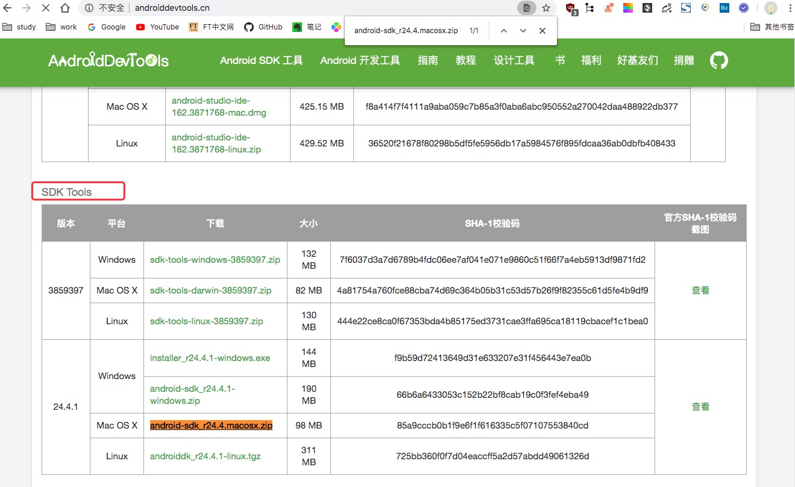

# 环境搭建

## 安装

1.下载java_jdk1.8:http://www.oracle.com/technetwork/java/javase/downloads/
jdk8-downloads-2133151.html


2.android-sdk:https://www.androiddevtools.cn/


下载android-sdk_r24.4.macosx.zip完成后解压，点击/tools/android 安装必要的工具 详解：https://www.cnblogs.com/du-hong/p/11003755.html或者https://www.cnblogs.com/yoyoketang/p/7189970.html

3.安装appium,下载安装地址：https://bitbucket.org/appium/appium.app/downloads/16

4.安装Node.js:下载官网地址：https://nodejs.org/en/download/23,安装完成后，运行cmd，输入node –v查看版本号，然后输入npm

5.模拟器

6.python文件中安装Appium-Python-Client:pip install Appium-Python-Client

## 环境变量

```.bash
vi ~/.bash_profile

#android-jdk
export ANDROID_HOME=/usr/local/opt/android-sdk-macosx
export PATH=${PATH}:${ANDROID_HOME}/tools
export PATH=${PATH}:${ANDROID_HOME}/platform-tools

#java
JAVA_HOME=/Library/Java/JavaVirtualMachines/jdk1.8.0_251.jdk/Contents/Home
PATH=$PATH:$JAVA_HOME/bin
CLASSPATH=.:$JAVA_HOME/lib/dt.jar:$JAVA_HOME/lib/tools.jar
export JAVA_HOME PATH CLASSPATH

检查是否安装成功：
1.打开cmd验证是否安装成功，输入java -version，然后输入javac
2..在cmd输入adb可以查看对应版本号
```

ps:
uiautomatorviewer出现Unable to connect to adb. Check if adb is installed correctly解决方法：
1.打开 uiautomatorviewer.bat，找到 uiautomatorviewer.bat 文件最后一行
2.将其中的binddir=%prog_dir%修改为 SDK 的 platform-tools 所在路径（我的 SDK 路径为：/usr/local/opt/android-sdk-macosx/platform-tools）
3."-Dcom.android.uiautomator.bindir=/usr/local/opt/android-sdk-macosx/platform-tools" -jar


