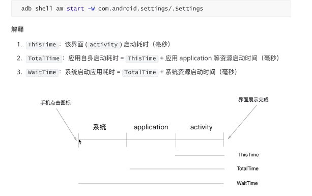

# 常用命令

| 作用 | 命令| 详情 |
| :-----| :---- | :----: |
| 获取包名和界面名 | linux/mac：adb shell dumpsys activity activities \| grep mFocusedActivity | windows: adb shell dumpsys activity activities \| findstr mFocusedActivity |
| 获取手机日志 | adb logcat   | 1.打开程序触发bug  2.使用命令，触发bug  3.获取日志信息 at前面 e开头 |
|查看连接设备|adb devices ||
|发送文件到手机|adb push 电脑文件路径  手机文件路径||
|从手机拉取文件|adb pull  手机文件路径   电脑文件路径 ||
|安装应用|adb install 路径/xx.apk||
|卸载应用|adb uninstall 包名||
|启动adb服务端|adb start-server||
|停止服务端|adb kill-server||
|帮助命令|adb --help||
|获取app启动时间|adb shell am start -W 包名/界面名|测试标准：参照同类软件，启动时间不超过1倍即可|

## 其他

adb -s cf27456f shell # 指定连接设备使用命令

adb install -r demo.apk #安装apk 到sd 卡：

adb uninstall -k cn.com.test.mobile #卸载app 但保留数据和缓存文件

adb shell pm list packages #列出手机装的所有app 的包名

adb shell pm list packages -3 #列出除了系统应用的第三方应用包名

adb shell pm clear cn.com.test.mobile #清除应用数据与缓存

adb shell am start -ncn.com.test.mobile/.ui.SplashActivity #启动应用

adb shell dumpsys package #包信息Package Information

adb shell dumpsys meminfo #内存使用情况Memory Usage

adb shell am force-stop cn.com.test.mobile #强制停止应用

adb logcat -c #清除log 缓存

adb reboot #重启

adb get-serialno #获取序列号

adb shell getprop ro.build.version.release #查看Android 系统版本

adb shell top -m 10 #查看占用内存前10 的app

adb bugreport #查看bug 报告

adb shell am start -W 包名/启动名 #获取app启动时间

> 1、列出手机装的所有app的包名：   
  adb shell pm list packages 
   
> 列出系统应用的所有包名：   
  adb shell pm list packages -s  

> 列出除了系统应用的第三方应用包名：  
  adb shell pm list packages -3                 
  aapt dump badging xxx.apk(安装包名称)  
