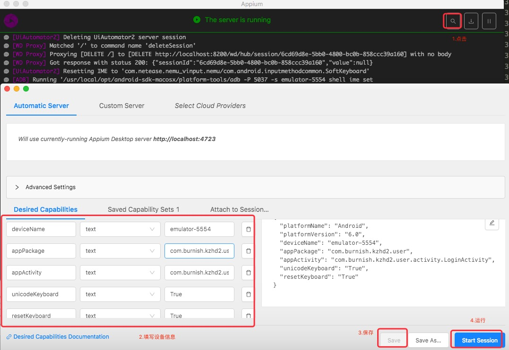

<!--
 * @Descripttion: 
 * @Author: zlj
 * @Date: 2020-06-24 14:12:04
-->

# 元素定位工具

## UIautomatorviewer

一、启动uiautomatorviewer：

1.cd /usr/local/opt/android-sdk-macosx/tools/

2../uiautomatorviewer

二、连接手机：

    1.cmd打开输入adb devices,确认手机已连上

    2.打开app，让屏幕处于点亮状态

    3.点左上角安卓机器人按钮Devices Screenshot按钮刷新页面

## Appium Inspector

