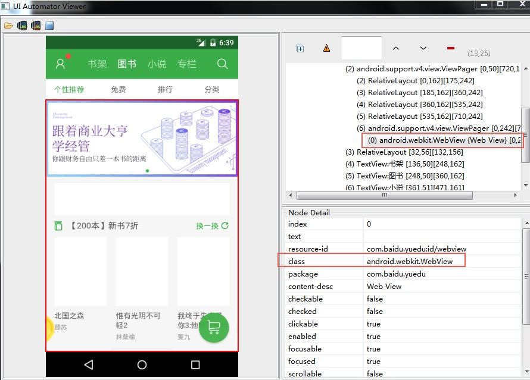

# native和webview切换

## 识别webview

1.用定位工具查看页面，发现页面上有些区域无法定位到，如下图左边红色区域，只能定位到这个大框框，红色框里面的元素是无法识别的。

2.这时候可以查看元素属性，如右图它的class属性，上面写着WebView，那毫无疑问这种页面就是webview了。

## 获取context

print(driver.contexts) 跟selenium的iframe类似

先获取页面是contexts环境，如下图红色区域，获取的是一个list列表：

NATIVE_APP:这个就是native，也就是原生的

WEBVIEW_com.xxxx :这个就是webview

## 切换webview

driver.switch_to.context("NATIVE_APP")

driver.switch_to.context(contexts[0])

driver.switch_to.context(contexts[1])

