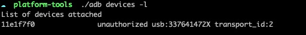
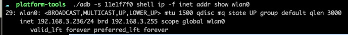

<!--
 * @Descripttion: 
 * @Author: zlj
 * @Date: 2021-06-17 16:59:55
-->
# 配置连接

Android真机： 小米9SE

1.Android和Mac连接同一个局域网

2.连接USB,打开Android机 USB调试

检查：
adb devices -l，显示Android序列号 ，表示通过USB连接成功

出现以上未授权（unauthorized）提示，是因为在安卓端，尚未允许计算机对设备进行调试，

此刻，点亮手机屏幕，会有相应的授权提示,确认之后，再次输入指令：adb devices ，即可成功连接设备
若有多个设备以下命令加参数-s 指定设备的序列号

3./adb  -s 11e1f7f0 tcpip 5555

4./adb -s 11e1f7f0 shell ip -f inet addr show wlan0

 5./adb connect 192.168.3.236:5555

6.打开Appium软件

查看连接手机的安装包：adb shell pm list package

查看连接手机的系统应用：adb shell pm list package -s

查看手机的第三方软件：adb shell pm list package -3

获取Activity：adb shell dumpsys package com.creditcloud.zmt
