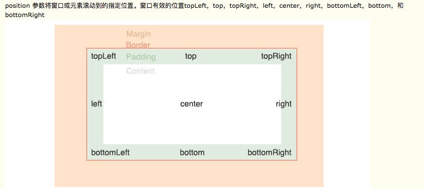

# 操作windows窗口滚动条(scrollTo)

cy.scrollTo(position)

cy.scrollTo(x, y, options)

option参数
```.bash
{log:true	在命令日志中显示命令
duration:0	滚动持续时间（以毫秒为单位）
easing:swing	将随着缓动动画滚动
timeout:500}

cy.scrollTo('bottom', { duration: 3000 })
```

## position 


cy.scrollTo('bottom')

## 坐标

x 横向左右滚动:

x 参数控制横向左右滚动，x参数可以是数字，也可以是字符串，也可以是百分比

```.bash
        // x 横向，距离左侧100像素，可以是数字100
        cy.scrollTo('100')
        cy.wait(3000)
        // x 横向，距离左侧150像素，可以是字符串150
        cy.scrollTo('150')
        // x 200像素
        cy.wait(3000)
        cy.scrollTo('200px')
        // 按百分比，滚动50%，也就是正中间
        cy.wait(3000)
        cy.scrollTo('50%')
```

y 纵向上下滚动:

y 参数控制纵向上下滚动，y参数可以是数字，也可以是字符串，也可以是百分比

```.bash
        // y 纵向 上下滚动，往下滚动100像素
        cy.scrollTo(0, 100)
        // 也可以传字符串
        cy.wait(3000)
        cy.scrollTo('0', '200')
        // 滚动到中间位置 50%
        cy.wait(3000)
        cy.scrollTo('0', '50%')
```
