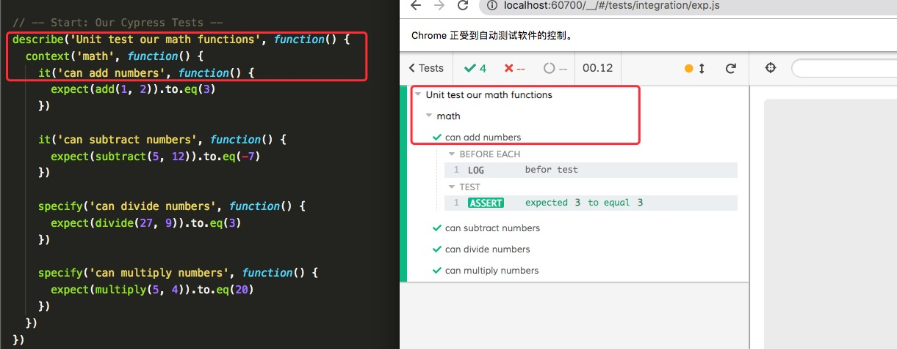
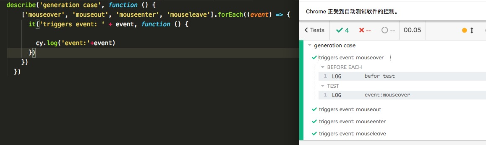

<!--
 * @Descripttion: 
 * @Author: zlj
 * @Date: 2020-04-28 14:42:55
--> 
# 编写和组织测试

## 目录结构

### Fixture文件：

测试过程中需要用到的外部静态数据，通常与 cy.fixture() 命令一起使用，并且最常用于存储 网络请求。

### 测试文件：

测试文件默认位于 cypress/integration 中。

### 插件（Plugin）文件：

Cypress将会在每个测试文件运行之前自动包含插件文件 cypress/plugins/index.js

### 支持（Support）文件：

Cypress会自动包含支持文件 cypress/support/index.js。该文件在每个测试文件之前运行

## describe()，context()，it()和specify()方法

describe应该是声明了一个TestSuit(测试集合) ，而且测试集合可以嵌套管理，而it声明定义了一个具体的测试用例


## 钩子(前置/后置)

测试运行之前或每次测试运行之前设置一些条件。它们也有助于在一系列测试后或每次测试后清理一些条件
```

describe('Hooks', function() {
  before(function() {
    // runs once before all tests in the block
  })

  after(function() {
    // runs once after all tests in the block
  })

  beforeEach(function() {
    // runs before each test in the block
  })

  afterEach(function() {
    // runs after each test in the block
  })
})
```

## 排除和包括测试

it.skip():需要跳过的套件或测试

it.only():要运行指定的套件或测试

```
 it.skip('can subtract numbers', function() {
        expect(subtract(5, 12)).to.eq(-7)
      })
  
      specify.only('can divide numbers', function() {
        expect(divide(27, 9)).to.eq(3)
      })
```

## 动态传参生产用例



## 监听测试文件

当使用 cypress open命令启动交互模式时，Cypress会监视测试文件的改动。添加或更新测试文件后，Cypress会重新加载并运行该spec文件中的所有测试；设置 watchForFileChanges 配置项为 false 将会禁用文件监视功能
