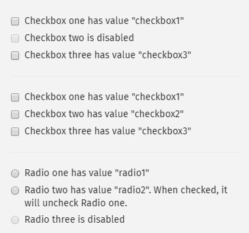

# 命令

## .type() 往输入框输入文本元素

```
cy.get('.action-email')
  .type('fake@email.com').should('have.value', 'fake@email.com')

  // 键盘的←→↑↓键
  .type('{leftarrow}{rightarrow}{uparrow}{downarrow}')
  //键盘的del键，全选，backspace键
  .type('{del}{selectall}{backspace}')

  // .type()键盘中的功能键 ctrl alt 
  .type('{alt}{option}') //these are equivalent
  .type('{ctrl}{control}') //these are equivalent
  .type('{meta}{command}{cmd}') //these are equivalent
  .type('{shift}')

  // 每个字符输入时，延迟0.1秒
  .type('slow.typing@email.com', { delay: 100 })
  .should('have.value', 'slow.typing@email.com')

cy.get('.action-disabled')
  // Ignore error checking prior to type
  // like whether the input is visible or disabled
  .type('disabled error checking', { force: true })
  .should('have.value', 'disabled error checking')
```

## .focus() 聚焦DOM元素

```
cy.get('.action-focus').focus()
  .should('have.class', 'focus')
  .prev().should('have.attr', 'style', 'color: orange;')
```

## .blur()让聚焦的DOM元素失焦

```.bash
// 输入内容后，再让输入框失焦
cy.get('[type="email"]').type('me@email.com').blur()

// 先聚焦再失焦
cy.get('[tabindex="1"]').focus().blur()
```

## .end() 结束命令链

```.bash
  cy.get('.ivu-input').type('123').end()
    .get('.search-btn > span').click()
```

## cy.exec() 执行系统命令

cy.exec('pwd')

## .clear() 清除DOM元素

```.bash
cy.get('.action-clear').type('Clear this text')
  .should('have.value', 'Clear this text')
  .clear()
  .should('have.value', '')
```

## cy.screenshot()屏幕截图

屏幕截图，保存路径cypress/screenshots/my-image.png

cy.screenshot('my-image')

## .submit() 提交表单

必须是 form 元素才能调用.submit()

```.bash
<form id="contact">
  <input type="text" name="message">
  <button type="submit">Send</button>
</form>

cy.get('#contact')
  .find('[type="text"]').type('HALFOFF')
cy.get('#contact').submit()
  .next().should('contain', 'Your form has been submitted!')
```

## cy.wrap()包装对象

```.bash
包装对象 {foo: bar}

cy.wrap({foo: 'bar'})
  .should('have.property', 'foo')
  .and('include', 'bar')
```


## .click() 点击DOM元素

```.bash
cy.get('.action-btn').click()

// 单击某个元素
cy.get('#action-canvas').click()
//在某个位置点击
cy.get('#action-canvas').click('topLeft')
cy.get('#action-canvas').click('top')
cy.get('#action-canvas').click('topRight')
cy.get('#action-canvas').click('left')
cy.get('#action-canvas').click('right')
cy.get('#action-canvas').click('bottomLeft')
cy.get('#action-canvas').click('bottom')
cy.get('#action-canvas').click('bottomRight')


//根据页面坐标点击
cy.get('#action-canvas')
  .click(80, 75)
  .click(170, 75)
  .click(80, 165)
  .click(100, 185)
  .click(125, 190)
  .click(150, 185)
  .click(170, 165)

// click multiple elements by passing multiple: true
cy.get('.action-labels>.label').click({ multiple: true })

//  即使该元素 “不可操作”，也会触发点击操作(强制点击)
cy.get('.action-opacity>.btn').click({ force: true })
```

## .dblclick() 双击 DOM 元素

```.bash
cy.get('.action-div').dblclick().should('not.be.visible')
cy.get('.action-input-hidden').should('be.visible')
```

## .rightclick() 右击DOM元素

```.bash
cy.get('.action-div').rightclick().should('not.be.visible')
cy.get('.action-input-hidden').should('be.visible')
```

## .check() 检查 checkbox or radio 选项框



```.bash
// By default, .check() will check all
// matching checkbox or radio elements in succession, one after another
cy.get('.action-checkboxes [type="checkbox"]').not('[disabled]')
  .check().should('be.checked')

cy.get('.action-radios [type="radio"]').not('[disabled]')
  .check().should('be.checked')

// .check() accepts a value argument
cy.get('.action-radios [type="radio"]')
  .check('radio1').should('be.checked')

// .check() accepts an array of values
cy.get('.action-multiple-checkboxes [type="checkbox"]')
  .check(['checkbox1', 'checkbox2']).should('be.checked')

// Ignore error checking prior to checking
cy.get('.action-checkboxes [disabled]')
  .check({ force: true }).should('be.checked')

cy.get('.action-radios [type="radio"]')
  .check('radio3', { force: true }).should('be.checked')
```
## .uncheck() 检查checkbox or radio 未被选中

```.bash
// By default, .uncheck() will uncheck all matching
// checkbox elements in succession, one after another
cy.get('.action-check [type="checkbox"]')
  .not('[disabled]')
  .uncheck().should('not.be.checked')

// .uncheck() accepts a value argument
cy.get('.action-check [type="checkbox"]')
  .check('checkbox1')
  .uncheck('checkbox1').should('not.be.checked')

// .uncheck() accepts an array of values
cy.get('.action-check [type="checkbox"]')
  .check(['checkbox1', 'checkbox3'])
  .uncheck(['checkbox1', 'checkbox3']).should('not.be.checked')

// Ignore error checking prior to unchecking
cy.get('.action-check [disabled]')
  .uncheck({ force: true }).should('not.be.checked')
```
##  .select() select 选项框

```
<form>
              <select class="form-control action-select">
                <option>--Select a fruit--</option>
                <option value="fr-apples">apples</option>
                <option value="fr-oranges">oranges</option>
                <option value="fr-bananas">bananas</option>
              </select>

              <select class="form-control action-select-multiple" multiple="true">
                <option value="fr-apples">apples</option>
                <option value="fr-oranges">oranges</option>
                <option value="fr-bananas">bananas</option>
              </select>
            </form>

```

```// Select 中传文本内容
cy.get('.action-select').select('apples')
cy.get('.action-select').select('apples',{force:true})

cy.get('.action-select-multiple')
.select(['apples', 'oranges', 'bananas'])

// Select 中传value属性值
cy.get('.action-select').select('fr-bananas')

cy.get('.action-select-multiple')
  .select(['fr-apples', 'fr-oranges', 'fr-bananas'])
  ```

## 强制

'''
// 强制点击这个元素
// 即使此元素‘不可操作’
cy.get('button').click({ force: true })
'''

## 坐标

```
cy.get('button').click({ position: 'topLeft' })
```

## .scrollIntoView()将指定  DOM 元素滑动到可视视图中的左上角

内嵌滚动条滑动,三种情况：左右滑动，上下滑动，同时可以左右上下滑动

```.bash
cy.get('#scroll).scrollIntoView({duration:2000})
```

## scorllTo 滑动浏览器自带的滚动条，元素的滚动条

```.bash
语法格式：
可以cy 直接调用，也可以是 DOM 元素来调用
cy.scrollTo(position)
cy.scrollTo(x, y)
cy.scrollTo(position, options)
cy.scrollTo(x, y, options)

// ---或---

.scrollTo(position)
.scrollTo(x, y)
.scrollTo(position, options)
.scrollTo(x, y, options)

// 整个页面往下滑动 500px
cy.scrollTo(0, 500)

// 滚动 .sidebar 元素到它的底部
cy.get('.sidebar').scrollTo('bottom')  
```

## 操作浏览器的命令

### cy.go()浏览器前后退

```.bash
cy.go('forward')/cy.go(1)

cy.go('back')/cy.go(-1)
```

### cy.reload()重新加载 

```.bash
cy.reload()

// 硬性加载 不用缓存
cy.reload(true)
```

### viewport 设置分辨率

```.bash
iphone-x	375	812
iphone-xr	414	896
macbook-11	1366	768
macbook-13	1280	800
具体详见https://docs.cypress.io/api/commands/viewport.html#Arguments
cy.viewport(1024, 768)
cy.viewport('iphone-6') 
```

## 获取页面全局对象的命令

windows窗口属性：

```.bash
cy.window()
要获取全局窗口对象，使用cy.window（）命令。
cy.window().should('have.property', 'top')


cy.document()
要获取document对象，请使用cy.document（）命令。
cy.document().should('have.property', 'charset').and('eq', 'UTF-8')


cy.title()
要获取标题，请使用cy.title（）命令。
cy.title().should('include', 'Kitchen Sink')

cy.url()
获取当前页面的URL

cy.location()
获取当前页面全局的Window.location对象
属性：hash，host，hostname，href，origin，pathname，port，protocol，search，toString
cy.location("host") 这样写只会返回对应属性的值

cy.document()
获取当前页面的全局Window.document对象

cy.hash()
获取当前页面的URL哈希值
等价于 cy.location('hash') 

cy.root()
获取根DOM元素
```

```
cy.get('.err').should('be.empty').and('be.hidden') // Assert '.err' is empty & hidden
```