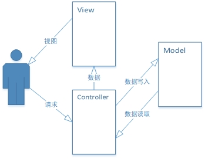
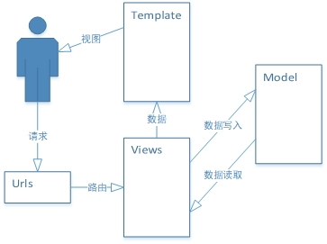
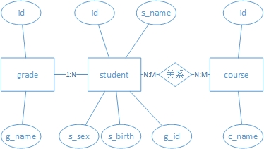

[TOC]

# Django Base Part2

## MVC设计模式

​	MVC全名是Model View Controller，是模型（model）-视图（view）-控制器（controller）的缩写，一种软件设计典范，用一种业务逻辑、数据、界面显示分离的方法组织代码，将业务逻辑聚集到一个部件里面，在改进和个性化定制界面及用户交互的同时，不需要重新编写业务逻辑。MVC被独特的发展起来用于映射传统的输入、处理和输出功能在一个逻辑的图形化用户界面的结构中。而Django是采用MVC模式的MTV框架。

- Model（模型）表示应用程序核心（比如数据库记录列表）。
- View（视图）显示数据（数据库记录）。
- Controller（控制器）处理输入（写入数据库记录）。

**Model（模型）** 是应用程序中用于处理应用程序数据逻辑的部分。通常模型对象负责在数据库中存取数据。

**View（视图）** 是应用程序中处理数据显示的部分。通常视图是依据模型数据创建的。

**Controller（控制器）** 是应用程序中处理用户交互的部分。通常控制器负责从视图读取数据，控制用户输入，并向模型发送数据。



​	Django的MTV模式本质上与MVC模式没有什么差别，也是各组件指尖为了保持松耦合关系，只是定义上有些许不同，Django的MTV分别代表：

- Model（模型）负责业务对象与数据库的对象（ORM）
- Template（模版）负责如何把页面展示给用户
- View（视图 ）负责业务逻辑，并在适当的时候调用Model和Template



## Model的创建

在这里模拟一个简单的项目场景来建立一张E-R实体联系图。学生选课系统

**student**表 学生， 字段有id，s_name，s_sex，s_birth， g_id外键关联班级表

**grade**表 班级， 字段有id，g_name, 

**course**表 课程， 字段有Id，c_name, student表与该表是多对多关系



```python
from django.db import models
import datetime


class Grade(models.Model):
    g_name = models.CharField(max_length=10)  # 班级名称

    class Meta:
        db_table = 'ele_gra'


class Course(models.Model):
    c_name = models.CharField(max_length=10)  # 课程名称

    class Meta:
        db_table = 'ele_cour'


class Student(models.Model):
    s_name = models.CharField(max_length=10)  # 学生名称
    s_sex = models.BooleanField(default=True)  # 性别
    s_birth = models.DateField()  # 生日
    g = models.ForeignKey(Grade)  # 1对多外键
    c = models.ManyToManyField(Course)  # 外键多对多

    @property
    def info(self):
        if self.s_sex:
            sex = '男'
        else:
            sex = '女'
        return '姓名%s,性别%s,生日%s' % (self.s_name, sex, self.s_birth)

    def baby_boomer_status(self):
        if self.s_birth < datetime.date(1980, 1, 1):
            return 'pre boomer'
        elif self.s_birth < datetime.date(1990, 1, 1):
            return 'baby boomer'
        else:
            return 'post boomer'

    class Meta:
        db_table = 'ele_stu'
```

## 将models映射到数据库中

将model映射到数据库中需要使用到两条命令

1. 使用 python manage.py makemigrations将Model生成映射文件

```bash
python manage.py makemigrations
```

2. 使用python manage.py migrate 将映射文件中的SQL语句在数据库中进行执行

```bash
python manage.py migrate
```

## Field types

Field types 对应了数据库中不同的数据类型

### AutoField 自增

是一个IntegerField根据可用ID自动递增，通常不需要直接使用，如果不另外指定，主键字段将自动添加到模型中。

### BigAutoField 64位自增

一个64位的整数，很像一个AutoField不同之处在于它是保证从适合数字1到9223372036854775807

### IntegerField 整型

一个整数。来自-2147483648到2147483647的值在Django支持的所有数据库中都是安全的。

### PositiveIntegerField 正整型

和IntegerField很像，但是必须是正整数和零(0)。0-2147483647在Django支持的所有数据库都是安全的。

### SmallIntegerField 短整型

和IntegerField很像，但只允许某个（数据库相关）点下的值。-32768到32767的值在Django支持的数据库中都是安全的。

### PositiveSmallIntegerField 短正整型

和PositiveIntegerField 很像，但只允许在某个（数据库相关）点下的值。0-32767在Django支持的数据库都是安全的。

### BigIntegerField 长整型

一个64位整数，很像IntegerField，但是不同之处在于它是保证数据从数字-9223372036854775808到9223372036854775807。

### BinaryField 二进制数据

用于存储原始二进制数据的字段。它只支持bytes分配。注意该字段的功能有限。

>**滥用BinaryField**
>
>尽管项目中可能会考虑在数据库中存储文件，但请考虑99%的情况下这是糟糕的设计。该字段不是正确的文件处理的替代品。

### BooleanField 布尔值

用于存储True/False两个值

### NullBooleanField 允许含空的布尔值

和BooleanField有点像，但允许NULL作为其中一个选项。使用这个类而不是BooleanField会导致null变为True。

### CharField 字符串

一个字符串字段，用于小到大尺寸的字符串。该类有一个额外的注意的地方。

> **CharField.max_length**
>
> 字段的最大长度（以字符串为单位）。max_length在数据库级别和Django的验证中执行。
>
> 如果你正在编写一个必须可移植到多个数据库后端的应用程序，则应该知道max_length对某些数据库后端存在限制

### TextField 文本字段

一个大文本字段。

### DateField 时间 年月日

日期，由Python以datetime.date实例表示。该字段有一些额外的可选参数：

**DateField.auto_now**

​	每次保存对象时自动将字段设置为现在。用于“上次修改”的时间戳。请注意，始终使用当前日期；这个默认值无法被重写。

​	该字段仅在被调用Model.save()时自动更新。你也可以使用QuerySet.update()来更新字段中的值。

**DateField.auto_now_add**

​	首次创建对象时，自动将字段设置为现在。用于创建时间戳，始终使用当前日期，该默认值无法被覆盖重写。所以即使你再创建对象时为此字段设置了一个值，它也是会被忽略。如果你希望能够通过代码来修改此字段，可以不使用auto_now_add=true参数。

使用默认值参数：defualt=date.today  (date对象来自于datetime模块的date对象)

**选项auto_now_add, auto_now和default是互斥的。这些选项的任何组合都会导致错误**

### DateTimeField 时间 年月日时分秒

日期和时间，由Python以datetime.datetime实例表示。与DateField相同也有**auto_now**,**auto_now_add**两个参数，参数的默认值都为False。

### TimeField 时间 时分秒

时间，时分秒的存储，由Python中的datetime.time实例表示。与DateField相同也有**auto_now**,**auto_now_add**两个参数，参数的默认值都为False。

### DecimalField 十进制

一个固定进度的十进制数，用Python在Decimal实例中表示。有两个必须的参数。

**DecimalField.max_digits**

​	数字运行的最大位数。**注意** ，此数字必须大于或等于**decimal_places**。

**DecimalField.decimal_places**

​	存储小数的位置。

比如，需要存储三位整数两位小数的浮点数，可以使用：

```python
models.DecimalField(max_digits=5, decimal_places=2)
```

> **注意**
>
> DecimalField和FloatField之间存在着非常大的差异，虽然都是用来表示实数。

### FloatField 浮点数

由float实例在Python中表示浮点数。

> decimal是支持快速正确舍入十进制浮点运算
>
> Decimal对比于Float的优点
>
> - Decimal “是基于一个浮点模型，该模型是以人为本设计的，并且必须有一个最重要的指导原则 - 计算机必须提供一种与人们在学校学习的算术相同的算法。” - 摘自十进制算术规范。
> - Decimal 数可以精确表示。相比之下，数字在二进制浮点中像 `1.1`和`2.2`没有精确的表示。最终用户通常不会像使用二进制浮点一样显示。`1.1 + 2.2` =`3.3000000000000003`
> - 精确性被转化为算术。在十进制浮点数中，正好等于零。在二进制浮点中，结果是。尽管接近于零，但差异阻止了可靠的平等测试，并且可能会积累差异。由于这个原因，在具有严格的等式不变量的会计应用中，小数是优选的。`0.1 + 0.1 + 0.1 -0.3`=`5.5511151231257827e-017`
> - Decimal 模块包含了重要位置的概念，因此是。尾随零保持显示重要性。这是货币应用的惯例。对于乘法，“教科书”方法使用被乘数中的所有数字。举例来说`1.30 + 1.20`=`2.50`，`1.3 * 1.2`=`1.56`，`1.30 * 1.20`=`1.5600`
> - 二进制和十进制浮点都是按照已发布的标准实现的。尽管内置的float类型只展示了它的功能中的一小部分，但Decimal 模块公开了标准的所有必需部分。在需要时，程序员可以完全控制舍入和信号处理。这包括通过使用例外来阻止任何不精确操作来强制执行精确算术的选项。
> - Decimal 模块被设计为支持“没有偏见，精确的未被占用的十进制算术（有时称为定点算术）和四舍五入的浮点算术。” - 摘自十进制算术规范。

### FileField 文件

文件上传字段（该字段以后再详细学习）

### FilePathField 目录文件名

实际上是CharField的再封装，其值仅限于文件系统上某个目录中的文件名。

### ImageField 图片文件

继承FileField的所有属性和方法，但也验证上传的对象是有效的图像。ImageField可以使用FileField的所有特殊属性，而且也具有height和width属性。

 ## Field对象常用参数

### null

如果为True，Django将像NULL数据库中那样存储空值。默认是False。

在实际开发中避免使用null基于字符串的字段，如CharField和TextField。如果一个基于字符串的字符有null=True，这意味着它有两种可能的值，一个的NULL和空字符串。在大多数情况下，无数据提供的两个值是多余的，Django约定是使用空字符串，而不是null。

### blank

如果为True，该字段被允许为空白。默认是False。

> blank 不同于null。null纯粹是与数据库相关的，而blank与验证相关。如果一个字段有blank=True,表单验证将允许输入一个空值，所以通常blank=True和null=True是同时出现的。如果字段blank=False，该字段将是必需的。

### db_column

用于此字段在数据库在列的名称，如果没有给出，Django将使用该字段的名称。

### db_index

如果为True，将为此字段创建数据库索引。

### default

字段的默认值。这可以是一个值或一个可调用的对象。如果可调用，则每次创建新对象时都会调用它。

默认不能是可变对象（模型实例，list，set等）。

### editable

如果False, 该字段将不会显示在管理员或任何其他ModelForm。在模型验证过程中它们也被跳过。默认是True。

### error_messages

该error_message参数允许你覆盖该字段将引发的默认消息。传入一个字典，其中包含与要覆盖的错误消息相匹配的密钥。

### primary_key

如果True，这个字段是模型的主键。

如果你没有primary_key=True你在你的模型中指定任何字段，Django会自动添加一个AutoField来保存主键，所以不需要primary_key=True在任何字段上设置，除非你想覆盖默认的主键行为。

primary_key=True暗示null=False和unique=True。一个对象只允许有一个主键。

主键字段是只读的，如果你更改现有对象上主键的值并保存它，则会在旧对象旁边创建一个新对象。

### unique

如果Ture，该字段在整个表格中必须是唯一的。

这是在数据库级和模型验证实施的。如果您尝试在unique字段中保存具有重复值django.db.IntegrityError的模型，则模型的save()方法将引发一个模型。

此选项在除ManyToManyField和OneToOneField以外的所有字段类型中都有效。

请注意，如果unique是True，则不需要指定db_index，因为unique意味着创建索引。

## 关系领域

### ForeignKey

多对一的关系，需要两个位置参数：模型相关的类和on_delete选项.

需要创建一个递归关系，一个与自身有多对一关系的对象

`models.ForeignKey('self', on_delete=models.CASCADE)`

**ForeignKey.on_delete**

当被引用的对象ForeignKey被删除时，Django将模拟on_delete参数指定的SQL约束的行为（在这里设置并不改变数据库中）

- CASCADE  级联删除。Django模拟SQL约束ON DELETE CASCADE的行为，并删除包含ForeignKey的对象
- PROTECT  通过引发ProtectedError，避免删除引用的对象
- SET_NULL 设置ForeignKey为null
- SET_DEFAULT  将ForeignKey设置为其默认值；ForeignKey必须设置默认值。
- SET()  ForeignKey  将该值设置为传递给的值SET()，或者如果传递了可调用对象，则调用它的结果做为值。
- DO_NOTHING  不采取行动。如果数据库后端强制执行参照完整性，则这将导致IntegrityError除非您手动将SQL约束添加到数据库字段。

### ManyToManyField

多对多的关系。需要一个位置参数：到模型相关的类，它可以作为与它完全一样的ForeignKey，包括递归和懒惰的关系。相关对象可以添加，删除或使用字段创建RelateManager

### OneToOneField

一对一的关系

**实例**

下面设计三个表，学生表， 学生额外信息表，班级表，课程表

```python
class Student(models.Model):
    name = models.CharField(max_length=10)
    age = models.IntegerField()
    sex = models.booleanField()
    info = models.OneToOneField(StudentInfo)
    g = models.ForeignKey(Grade)
    s = models.ManyToManyField(Subject)
    
class StudentInfo(models.Model):
    addr = models.CharField(max_length=100)
    fathername = models.CharField(max_length=10)
    mothername = models.CharField(max_length=10)
    
class Grade(models.Model):  # 班级表
	name = models.CharField(max_length=20)
    class_teacher = models.CharField(max_length=10) 
    
class Subject(models.Model):  # 课程表
    name = models.CharField(max_length=20)
    describe = models.CharField(max_length=100)
    num_people = models.IntegerField()
```
在上面的关系表中，包含了一对一，一对多，多对多的情况，下面讲解介绍如何使用

**一对一**

- 通过地址找到学生

```python
info = StudentInfo.object.filter(addr='xxxxxxx').first()
student = Student.object.filter(info=info)
```

- 通过学生找地址

```python
address = Student.object.get(pk=1).info.addr
```

**一对多**

- 通过学生查班级

```python
grade_name = Student.object.get(pk=1).g.name
```

- 通过班级查学生

```python
students = Grade.object.get(pk=1).student_set.all()
```

**多对多**

- 通过学生查课程

```python
subjects = Student.object.get(pk=1).subject_set.all()
```

- 通过课程查学生

```python
students = Subject.object.get(pk=1).student_set.all()
```

