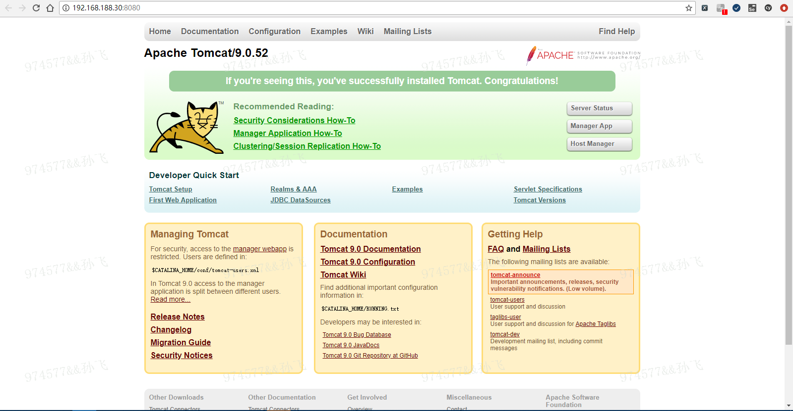

# Dockerfile 基于CENTOS8镜像搭建TOMCAT服务

## Docker构建镜像的方法主要有两种：

    （1）使用docker commit命令
    （2）使用docker build命令和Dockerfile文件（更为强大、灵活和常用）;

## 下载jdk、tomcat安装包，上传本地服务器 /mydocker/tomcat 目录下

    jdk1.8下载：http://www.oracle.com/technetwork/java/javase/downloads/jdk8-downloads-2133151.html
    tomcat8下载：https://tomcat.apache.org/download-80.cgi

## 创建Dockerfile文件路径
  
    mkdir /mydocker/tomcat
    cd /mydocker/tomcat
    vim Dockerfile
    将软件包考入当前目录：
    1、jdk-8u221-linux-x64.tar.gz
    2、apache-tomcat-9.0.52.tar.gz 

## 创建容器

    docker build -t centos8:tomcat .  

## 运行容器

    docker run -d -p 8080:8080 --name tomcat9 centos8:tomcat
    
## 测试  

    docker port c1190a438780364
    8080/tcp -> 0.0.0.0:32771
    
## 打开网页
