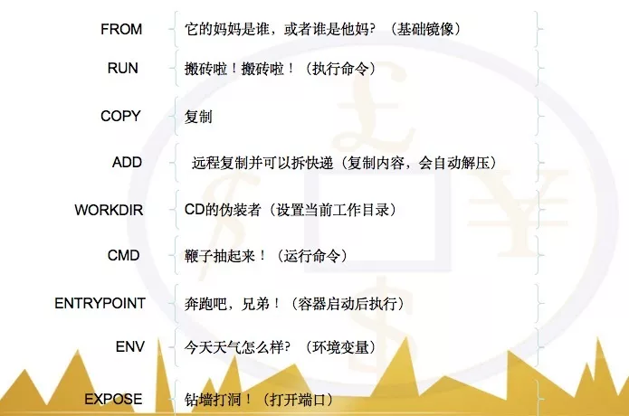

# Docker

## [Docker](https://www.runoob.com/docker/centos-docker-install.html) 基本命令

### Docker 安装   

- 卸载旧版本  

 > sudo yum remove docker \
           docker-client \
           docker-client-latest \
           docker-common \
           docker-latest \
           docker-latest-logrotate \
           docker-logrotate \
           docker-engine
     
- 安装所需的软件包。yum-utils 提供了 yum-config-manager ，并且 device mapper 存储驱动程序需要 device-mapper-persistent-data和lvm2    
  
 > sudo yum install -y yum-utils device-mapper-persistent-data lvm2  

- 设置稳定的仓库(添加软件源信息)   

 > sudo yum-config-manager --add-repo http://mirrors.aliyun.com/docker-ce/linux/centos/docker-ce.repo  
  
- 更新 yum 缓存：  

 > sudo yum makecache fast  
  
- 安装 Docker Engine-Community   
 
 > sudo yum install docker-ce docker-ce-cli containerd.io  

- 启动docker  

 > sudo systemctl start docker   

- 通过运行 hello-world 映像来验证是否正确安装了 Docker Engine-Community  
  
 > sudo docker run hello-world  

- 配置镜像加速器  

 > sudo mkdir -p /etc/docker     
 > sudo tee /etc/docker/daemon.json <<-'EOF'   
  {
    "registry-mirrors": ["https://o9nqigxx.mirror.aliyuncs.com"]  
  }  
  EOF  
 > sudo systemctl daemon-reload   
 > sudo systemctl restart docker  
  
- systemctl命令是系统服务管理器指令:
 > 启动docker： systemctl start docker  
 > 停止docker： systemctl stop docker  
 > 重启docker： systemctl restart docker  
 > 查看docker状态： systemctl status docker  
 > 开机启动： systemctl enable docker  
***

### Docker 基本命令
  
 > 查看docker概要信息: docker info  
 > 查看docker帮助文档: docker ‐‐help  
 > 查看镜像：docker images  
 > 查看运行的容器：docker ps  
 > 查看所有的容器：docker ps -a  
 > 停止运行容器：docker stop <容器 ID>  
 > 运行容器：docker run -it <容器 ID> /bin/bash  
 > 进入容器：docker exec -it <容器 ID> /bin/bash  
 > 删除容器：docker rm -f <容器 ID>  
 > 查看容器内的标准输出：docker logs -f <容器 ID>  
***     
     
### Docker 容器卷
  
- 用处 
 > 容器的持久化
 > 容器间继承+数据共享
  
- 基本用法
 > docker run -it -v /mydatavolume:/mydatavolumecontainer centos
 > 设置只读权限：docker run -it -v /mydatavolume:/mydatavolumecontainer:ro centos
 > docker inspect <容器 ID>
 
- 利用 Dockerfile 创建容器卷  
 > 创建Dockerfile文件目录： 
   mkdir /mydocker/  
   vim /mydocker/dockerfile  
   FROM centos  
   VOLUME ["/dataVolumeContainer1","/dataVolumeContainer2"]   
   CMD echo "finished,------success1"   
   CMD /bin/bash  
 
 > 等价于：docker run -it -v /host1:/dataVolumeContainer1 -v /host2:/dataVolumeContainer2 /bin/bash

 > 运行 Dockerfile  
   docker build -f /mydocker/Dockerfile -t sunfei/centos .  
   docker images
    
 > 运行容器卷镜像   
   docker run -it  sunfei/centos  
 
 > 容器数据卷-容器间数据共享  
   docker run -it --name dc01 sunfei/centos  
   docker run -it --name dc02 --volumes-from dc01 sunfei/centos  
   docker run -it --name dc03 --volumes-from dc01 sunfei/centos  
   创建文件：touch dc01_add.txt  
      
       
### Dockerfile   
 > 创建Dockerfile文件目录： 
   mkdir /mydocker/
   vim /mydocker/dockerfile

     # Base images 基础镜像
     FROM centos

     # MAINTAINER 维护者信息  
     MAINTAINER lorenwe   

     # ENV 设置环境变量  
     ENV PATH /usr/local/nginx/sbin:$PATH  

     # ADD  文件放在当前目录下，拷过去会自动解压  
     ADD nginx-1.13.7.tar.gz /tmp/ 

     # RUN 执行以下命令  
     RUN rpm --import /etc/pki/rpm-gpg/RPM-GPG-KEY-CentOS-7 \
     && yum update -y \
     && yum install -y vim less wget curl gcc automake autoconf libtool make gcc-c++ zlib zlib-devel openssl openssl-devel perl perl-devel pcre pcre-devel libxslt libxslt-devel \
     && yum clean all \  
     && rm -rf /usr/local/src/*  
     RUN useradd -s /sbin/nologin -M www  

     # WORKDIR 相当于cd  
     WORKDIR /tmp/nginx-1.13.7    

     RUN ./configure --prefix=/usr/local/nginx --user=www --group=www --with-http_ssl_module --with-pcre && make && make install  

     RUN cd / && rm -rf /tmp/  

     COPY nginx.conf /usr/local/nginx/conf/  

     # EXPOSE 映射端口  
     EXPOSE 80 443  

     # ENTRYPOINT 运行以下命令  
     ENTRYPOINT ["nginx"]  

     # CMD 运行以下命令  
     CMD ["-h"]复制代码  
        
 > 构建镜像
   docker build -t nginx:v3 . 
   docker build -f /mydocker/Dockerfile -t sunfei/centos . 

   
 关于dockerfile

虽然我们可以通过docker commit命令来手动创建镜像，但是通过Dockerfile文件，可以帮助我们自动创建镜像，并且能够自定义创建过程。本质上，Dockerfile就是由一系列命令和参数构成的脚本，这些命令应用于基础镜像并最终创建一个新的镜像。它简化了从头到尾的构建流程并极大的简化了部署工作。使用dockerfile构建镜像有以下好处：

像编程一样构建镜像，支持分层构建以及缓存；

可以快速而精确地重新创建镜像以便于维护和升级；

便于持续集成；

可以在任何地方快速构建镜像

 

Dockerfile指令

我们需要了解一些基本的Dockerfile 指令，Dockerfile 指令为 Docker 引擎提供了创建容器映像所需的步骤。这些指令按顺序逐一执行。以下是有关一些基本 Dockerfile 指令的详细信息。

1.FROM

FROM 指令用于设置在新映像创建过程期间将使用的容器映像。

格式：FROM 

示例：

FROM nginx

FROM microsoft/dotnet:2.1-aspnetcore-runtime

 

 

2.RUN

RUN 指令指定将要运行并捕获到新容器映像中的命令。 这些命令包括安装软件、创建文件和目录，以及创建环境配置等。

格式：

RUN ["", "", ""]

RUN

示例：

RUN apt-get update

RUN mkdir -p /usr/src/redis

RUN apt-get update && apt-get install -y libgdiplus

RUN ["apt-get","install","-y","nginx"]

注意：每一个指令都会创建一层，并构成新的镜像。当运行多个指令时，会产生一些非常臃肿、非常多层的镜像，不仅仅增加了构建部署的时间，也很容易出错。因此，在很多情况下，我们可以合并指令并运行，例如：RUN apt-get update && apt-get install -y libgdiplus。在命令过多时，一定要注意格式，比如换行、缩进、注释等，会让维护、排障更为容易，这是一个比较好的习惯。使用换行符时，可能会遇到一些问题，具体可以参阅下节的转义字符。

 

3.COPY

COPY 指令将文件和目录复制到容器的文件系统。文件和目录需位于相对于 Dockerfile 的路径中。

格式：

COPY

如果源或目标包含空格，请将路径括在方括号和双引号中。

 

COPY ["", ""]

示例：

COPY . .

COPY nginx.conf /etc/nginx/nginx.conf

COPY . /usr/share/nginx/html

COPY hom* /mydir/

 

4.ADD

ADD 指令与 COPY 指令非常类似，但它包含更多功能。除了将文件从主机复制到容器映像，ADD 指令还可以使用 URL 规范从远程位置复制文件。

格式：

ADD<source> <destination>

示例：

ADD https://www.python.org/ftp/python/3.5.1/python-3.5.1.exe /temp/python-3.5.1.exe

此示例会将 Python for Windows下载到容器映像的 c:\temp 目录。

 

5.WORKDIR

WORKDIR 指令用于为其他 Dockerfile 指令（如 RUN、CMD）设置一个工作目录，并且还设置用于运行容器映像实例的工作目录。

格式：

WORKDIR

示例：

WORKDIR /app

 

6.CMD

CMD指令用于设置部署容器映像的实例时要运行的默认命令。例如，如果该容器将承载 NGINX Web 服务器，则 CMD 可能包括用于启动Web服务器的指令，如 nginx.exe。 如果 Dockerfile 中指定了多个CMD 指令，只会计算最后一个指令。

格式：

CMD ["<executable", "

CMD

示例：

CMD ["c:\\Apache24\\bin\\httpd.exe", "-w"]

CMD c:\\Apache24\\bin\\httpd.exe -w

 

7.ENTRYPOINT

配置容器启动后执行的命令，并且不可被 docker run 提供的参数覆盖。每个 Dockerfile 中只能有一个ENTRYPOINT，当指定多个时，只有最后一个起效。

格式：

ENTRYPOINT ["", ""]

示例：

ENTRYPOINT ["dotnet", "Magicodes.Admin.Web.Host.dll"]

 

8.ENV

ENV命令用于设置环境变量。这些变量以”key=value”的形式存在，并可以在容器内被脚本或者程序调用。这个机制给在容器中运行应用带来了极大的便利。

格式：

ENV==...

示例：

ENV VERSION=1.0 DEBUG=on \

NAME="Magicodes"

 

9.EXPOSE

EXPOSE用来指定端口，使容器内的应用可以通过端口和外界交互。

格式：

EXPOSE

示例：

EXPOSE 80  

下图来一言以蔽之：  

   
   
   
   

 ## docker-appnium
 
   * 搜索镜像： docker search appium
   * 拉取镜像： docker pull appium/appium
   * 启动容器： docker run --privileged -d -p 4723:4723 --name container-appium appium/appium
   --privileged： 使用该参数，容器内的root真正拥有root权限，否则容器内的root只是外部的一个普通用户权限
   -d: 以分离模式启动容器，分离模式指的是后台运行；而前景模式指的是前台运行，默认分离模式设置为False;
   -p: 指定要映射的IP和端口；
   --name: 为容器指定一个名字

1.进入virtualbox官网

https://www.virtualbox.org/

2. 首先下载oracle_vbox.asc文件到本地：

wget -q https://www.virtualbox.org/download/oracle_vbox.asc

再执行import：

sudo rpm --import oracle_vbox.asc

3. cd 进入目录：/etc/yum.repos.d

4.在/etc/yum.repos.d/目录下新建virtualbox.repo并写入如下内容

[virtualbox]
name=Oracle Linux / RHEL / CentOS-$releasever / $basearch - VirtualBox
baseurl=http://download.virtualbox.org/virtualbox/rpm/el/$releasever/$basearch
enabled=1
gpgcheck=1
repo_gpgcheck=1
gpgkey=https://www.virtualbox.org/download/oracle_vbox.asc

5.更新yum缓存

yum clean all

yum makecache

6.安装virtualbox

yum install VirtualBox-5.1

/sbin/vboxconfig

yum istall kernel-devel
