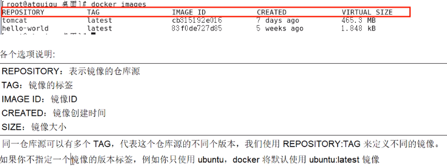
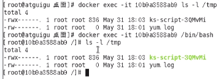
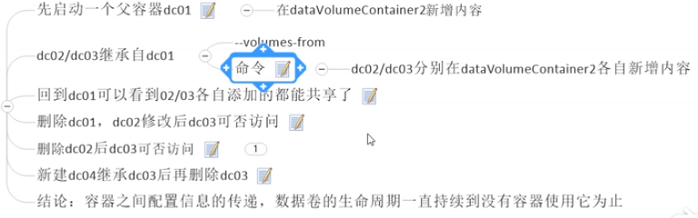

# Docker的使用

Ddocker是基于Go语言实现的开源项目，主要目标是：“一次封装，到处运行”

## dockers是什么：容器虚拟化技术

解决了运行环境和配置问题软件容器，方便做持续集成并有助于整体发布的容器虚拟化技术

## docker能干嘛

与虚拟机的区别：
虚拟机就是带环境安装的一种解决方案。它可以在一种操作系统里面运行另一种操作系统，对于底层系统来说，虚拟机就是一个普通文件。能够使应用程序，操作系统和硬件三者之间的逻辑不变。
容器与虚拟机不同，不需要捆绑一整套操作系统，只需要软件工作所需的资源和设置,系统因此变得高效轻量，并保证部署在任何环境中的软件都能始终如一的运行
1.传统虚拟技术是虚拟出一套硬件后，在其上运行一个完整的操作系统，在系统上再运行所需的应用进程
2.而容器内的应用进程直接运行于宿主机的内核，容器内没有自己的内核，也没有硬件虚拟，因此更轻便
每个容器之间相互隔离，每个容器有自己的文件系统，容器之间不会相互影响，能区分计算资源

## 常用命令

### 帮助命令

```bash
版本信息：docker version
版本描述：docker info
帮助命令：docker help

```

### 镜像命令

列出本地主机上的镜像：docker images 

```bash
options:
-a:列出本地所有的镜像（含中间映像层）
-q:只显示镜像ID
--digests:显示镜像的摘要信息
--no-trunc:显示完整的镜像信息
```



### 搜索镜像

```bash
docker search 镜像名
options：
--no-trunc:显示完整的镜像描述
-s:列出收藏数不孝顺指定值的镜像
--automated:只列出automated build类型镜像
```

### 下载镜像

```bash
docker pull  镜像名[:TAG]
```

### 删除镜像

```bash
删除镜像：docker rmi  镜像名ID
删除单个：docker rmi -f 镜像ID
删除多个：docker rmi -f 镜像名1 镜像名2
删除全部：docker rmi -f  ${docker images -qa}
```

docker commit 提交容器副本使之成为一个新的镜像:
docker commit -m="提交的描述信息" -a="作者" 容器ID 要创建的目标镜像名 :标签名

### 容器命令

```bash
新建并启动容器：
互交方式：docker run -it imageID或镜像名
options：
--name="容器新名字"：为容器指定一个名字
-d:后台运行容器，并返回容器ID，也即启动守护式容器
-i:以互交模式运行容器
-t:为容器重新分配一个伪输入终端
-P：随机端口映射
-p：指定端口映射   主机端口：docker容器端口
```

### 列出当前所有正在运行的容器

```bash
docker ps [options]
options:
-a：列出当前所有正在运行的容器+历史上运行过的
-l:显示最近创建的容器
-n:显示最近n个创建的容器
-q：静默模式，只显示容器编码
--no-trunc:不截断输出
```

### 退出容器

```bash
exit:容器停止退出
ctrl+p+q：容器不停止退出
```

### 启动容器

```bash
docker start 容器ID或容器名
```

### 重启容器

```bash
docker restart 容器ID或容器名
```

### 停止容器

```bash
docker stop 容器ID或容器名
```

### 强制停止容器

```bash
docker kill 容器ID或容器名
```

### 删除已停止的容器：（-f 可以删除在运行的容器）

```bash
docker rm 容器ID
```

### 一次性删除多个容器

```bash
docker rm -f ${docker ps -qa}
```

### 后台运行容器

```bash
docker run -d 镜像名
然后docker ps -a查看会发现容器已经退出：docker容器后台运行就必须有一个前台进程。
容器运行的命令如果不是那些一直挂起的命令（top,tail）,就会自动退出
```

### 查看容器日志

```bash
docker logs -f -t --tail 容器ID
-t:是加入时间戳
-f:跟随最新的日志打印
--tail 数字:显示最后多少条
```


### 查看容器内运行的进程

```bash
docker top 容器ID
```

### 查看容器内部细节

```bash
docker inspect 容器ID
```

### 进入正在运行的容器（ctrl+p+q）并以命令行交互

```bash
docker exec -it 容器ID bashshell
docker attach 容器ID
区别：attach:直接进入容器启动命令终端，不会启动新的进程（进容器再执行命令）
exec:是在容器中打开新的终端，并且可以启动新的进程（即可以进容器也可以不进容器直接执行命令
```


### 从容器内拷贝文件到主机上

docker cp 容器ID：容器内路径 目的主机路径


### 数据卷

保存数据，做数据持久化，容器间数据共享
```bash
添加数据卷：
命令方式：docker run it -v /宿主机绝对路径目录:/容器内目录 镜像名 --privileged=true

容器停止退出后，主机修改后数据同步
容器内数据卷只读权限：docker run it -v /宿主机绝对路径目录:/容器内目录:ro  镜像名
```

### Dockerfile

```bash
1.主机根目录下新建mydocker文件夹并进入
2.vim Dockerfile
3.docker build -f /mydocker/Dockerfile -t zlj/centos .
4. docker run -it zlj/centos
5.查看宿主机上的 docker inspect   zlj/centos
```

### 数据卷容器

```bash
活动硬盘上挂活动硬盘实现数据传递依赖
docker run -it --name dc01 zlj/centos
docker run -it --name dc02 --volumes-from dc01 zlj/centos
```


### Dockerfile:构建镜像的文件

```bash
1.手动编写dockerfile文件
2.docker build 获得一个自定义的镜像
3.run
```

### Docker执行Dockerfile的大致流程
```bash
1.docker 从基础镜像运行一个容器
2执行一条指令并对容器做出修改
3.执行类似docker commit的操作提交一个新的镜像层
4.docker 再基于刚提交的镜像运行一个新的容器
5.执行dockerfile中下一条指令直到所有指令都执行完成
```

### 保留字
```bash
FROM：基础镜像，当前新镜像是基于哪个镜像的
MAINTAINER:镜像维护者的名字和邮箱
RUN：容器构建时需要运行的命令
EXPOSE:当前容器对外暴露的端口号
WORKDIR:指定在创建容器后，终端默认登录进来的工作目录，一个落脚点
ENV:用来构建镜像过程中设置环境变量
ADD:将宿主机目录下的文件拷贝进镜像，且ADD命令会自动处理URL和解压缩tar
COPY:类似ADD，拷贝文件和目录到镜像中，将从构建上下文目录中《源路径》的文件/目录复制到新的一层的镜像内的《目标路径》位置
VOLUME:容器数据卷，用于数据保存和持久化工作
CMD:指定一个容器启动时要运行的命令（Dockerfile中可以有多个CMD命令，但只有最后一个生效，CMD会被docker run 之后的参数替换）
ENIRYPOINT:指定一个容器启动时要运行的命令,CMD类似，但 是追加的形式
ONBUILD:当构建一个被继承的Dockerfile时运行命令，父镜像在被子镜像继承后父镜像的onbuild被触发
```

### 虚悬镜像
新镜像跟旧的镜像同名，导致旧镜像名称被取消，从而出现了仓库名和标签均为<none>的镜像,这类镜像已经失去了其价值，可以随意删除掉
```bash
显示所有虚悬镜像命令：
docker image ls -f dangling=true
删除所有虚悬镜像命令：
docker image prune
```
