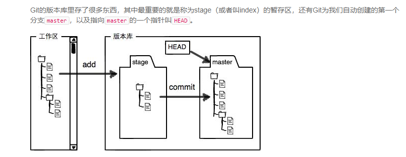

# Git常用命令

## git init
**实例**

```bash
1.$ mkdir learngit
2.$cd ./learngit/
3.$git init  命令把这个目录变成Git可以管理的仓库
```

## git add

将文件从工作目录添加到缓存区（Index）

**实例**

```bash
$ touch README.md
$ git add README.md
```

添加全部文件到缓存区

```bash
$ git add *
```

## git commit

将缓存区的改动提交到HEAD中，但是并没有提交到远程仓库中

**实例**

```bash
$ git commit -m '创建readme.md文件'
```

## git config

对当前系统中的Git进行配置相应参数

**实例**

配置用户名和邮箱

```bash
$ git config --global user.name "xxxx"
$ git config --global user.email xxxxx@qq.com
```

## git remote add origin &lt;server&gt;

设置远端仓库地址，可以将本地仓库与远程服务器进行链接

**实例**

```bash
 $ git remote add origin git@github.com: xxxx/test.git
```

**小技巧**
> 当源不可用或地址出错时，可以在.git/congif中手动的配置源的地址
> ```bash
>  $ cd .git/
> [tianjun@localhost .git]$ vim config 
>
>   1 [core]
>   2     repositoryformatversion = 0
>   3     filemode = true
>   4     bare = false
>   5     logallrefupdates = true
>   6 [remote "origin"]
>   7     url = https://github.com/ xxxx/test.git  # 修改该URL地址即可
>   8     fetch = +refs/heads/*:refs/remotes/origin/*
>   9 [branch "master"]
>  10     remote = origin
>  11     merge = refs/heads/master
> ```
>

## git push -u origin &lt;branch&gt;

将本地仓库的参数分支推送到远端仓库中

**实例**

```bash
 $ git push -u origin master
Username for 'https://github.com': xxx@qq.com
Password for 'https://xxx@qq.com@github.com': 
Counting objects: 3, done.
Writing objects: 100% (3/3), 237 bytes | 0 bytes/s, done.
Total 3 (delta 0), reused 0 (delta 0)
To https://github.com/xxx/test.git
 * [new branch]      master -> master
分支 master 设置为跟踪来自 origin 的远程分支 master。
```

## git checkout -b &lt;branch&gt;

在本地新建一个分支，并切换到新建分支

**实例**

```bash
 $ git checkout -b ttc
切换到一个新分支 'ttc'
```

## git branch

查看当前所有分支

**实例**

```bash
 $ git branch
  master
* ttc
```

## git checkout &lt;branch&gt;

切换分支

**实例**

```bash
 $ git checkout master 
切换到分支 'master'
```

## git branch -d &lt;branch&gt;

删除分支

**实例**

```bash
git branch -d ttc
已删除分支 ttc（曾为 d259848）。
```

## git diff &lt;branch1&gt; &lt;branch2&gt;

比较分支1和分支2的不同

**实例**

```bash
 $ git diff ttc master
diff --git a/README.md b/README.md
index ce071e8..e69de29 100644
--- a/README.md
+++ b/README.md
@@ -1,3 +0,0 @@
-# test
- 
-This branch is TTC
```

## git merge &lt;branch&gt; 

将参数分支合并到当前分支

**实例**

将ttc分支合并到master分支

```bash
 $ git commit -m 'this is master'
[master 0a856b8] this is master
 1 file changed, 3 insertions(+)
 $ git merge ttc
自动合并 README.md
冲突（内容）：合并冲突于 README.md
自动合并失败，修正冲突然后提交修正的结果。
```

当合并分支时发生冲突，需要手动的修改冲突。我们可以打开冲突文件可以看到

```bash
  1 <<<<<<< HEAD
  2 # master
  3 
  4 This branch is master
  5 =======
  6 # test
  7 
  8 This branch is TTC
  9 >>>>>>> ttc

```

这时只需要删除你不需要的部分，保留你需要的部分

我将文件修改为

```bash
# master

This branch is master what have merged ttc. 
```

处理完成冲突后，需要将文件加到缓存区，然后再commit到HEAD，就完成了冲突的处理

```bash
 $ git add README.md
 $ git commit -m '合并了tcc分支'
[master 6b42974] 合并了tcc分支
```

## 提交日志

git log 命令可以显示所有提交过的版本信息， git log--pretty=oneline
git reflog 可以查看所有分支的所有操作记录（包括已经被删除的 commit 记录和 reset 的操作）

## 版本回退

```bash
回退到上一个版本：使用git reset命令
$ git reset --hard HEAD^
HEAD is now at e475afc add distributed
HEAD指向的版本就是当前版本，因此，Git允许我们在版本的历史之间穿梭，使用命令git reset --hard commit_id。

指定回到未来的某个版本
$ git reset --hard 1094a
HEAD is now at 83b0afe append GPL
找不到新版本的commit id， Git提供了一个命令git reflog用来记录你的每一次命令，
```

## 撤销修改

```bash
场景1：当你改乱了工作区某个文件的内容，想直接丢弃工作区的修改时，用命令git checkout -- file。
场景2：当你不但改乱了工作区某个文件的内容，还添加到了暂存区时，想丢弃修改，分两步，第一步用命令git reset HEAD <file>，就回到了场景1，第二步按场景1操作。
场景3：已经提交了不合适的修改到版本库时，想要撤销本次提交，参考版本回退一节，不过前提是没有推送到远程库。
```

## git tag -a [版本号] -m [注解]

为当前版本的文件添加一个版本标签和响应的注解

**实例**

为项目添加一个版本号为v0.0.1 注解为‘这是一个测试项目’的tag

```bash
 $ git tag -a v0.0.1 -m '这是一个测试项目'
```

## git push origin [版本号]

将与参数对应版本的tag push到远程仓库中

**实例**

将版本号为v0.0.1的tag 推送到远端服务器上

```bash
 $ git push origin v0.0.1
Username for 'https://github.com': xxx@qq.com
Password for 'https://xxx@qq.com@github.com': 
Counting objects: 12, done.
Delta compression using up to 2 threads.
Compressing objects: 100% (5/5), done.
Writing objects: 100% (10/10), 923 bytes | 0 bytes/s, done.
Total 10 (delta 1), reused 0 (delta 0)
remote: Resolving deltas: 100% (1/1), done.
To https://github.com/ xxxx/test.git
 * [new tag]         v0.0.1 -> v0.0.1
```

## git push origin --delete &lt;branch&gt;

删除远端服务器的分支

**实例**

创建ttc分支，然后将分支push到服务器上，然后删除服务器上的分支

```bash
 $ git checkout ttc
切换到分支 'ttc'
 $ git push origin ttc
Username for 'https://github.com':  xxxx@qq.com
Password for 'https:// xxxx@qq.com@github.com': 
Total 0 (delta 0), reused 0 (delta 0)
To https://github.com/ xxxx/test.git
 * [new branch]      ttc -> ttc
 $ git push origin --delete ttc
Username for 'https://github.com':  xxxx@qq.com
Password for 'https:// xxxx@qq.com@github.com': 
To https://github.com/ xxxx/test.git
 - [deleted]         ttc
```

## git push origin --delete tag &lt;版本号&gt;

删除远端服务器的标签

**实例**

删除之前创建的tag v0.0.1

```bash
 $ git push origin --delete tag v0.0.1
Username for 'https://github.com':  xxxx@qq.com
Password for 'https:// xxxx@qq.com@github.com': 
To https://github.com/ xxxx/test.git
 - [deleted]         v0.0.1
```

## git stash 

缓存当前

## git stash list

查看缓存

## git stash apply stash@{x} &lt;缓存名称&gt;

git stash apply恢复，但是恢复后，stash内容并不删除，你需要用git stash drop来删除；
git stash pop，恢复的同时把stash内容也删了，恢复的时候，先用git stash list查看，然后恢复指定的stash，用命令：$ git stash apply stash@{0}

小结：修复bug时，我们会通过创建新的bug分支进行修复，然后合并，最后删除；
当手头工作没有完成时，先把工作现场git stash一下，然后去修复bug，修复后，再git stash pop，回到工作现场。

## 工作区和暂存区

工作区： 在电脑里能看到的目录，比如我的learngit文件夹就是一个工作区
版本库： 工作区有一个隐藏目录.git，这个不算工作区，而是Git的版本库。

把文件往Git版本库里：、
第一步是用git add把文件添加进去，实际上就是把文件修改添加到暂存区；
第二步是用git commit提交更改，实际上就是把暂存区的所有内容提交到当前分支。
git status查看一下状态：没有被添加过，所以它的状态是Untracked

## 标准工作流

### 1.Creating a Fork
```bash
Clone your fork to your local machine
git clone git@github.com:USERNAME/FORKED-PROJECT.git
```

### 2.Keeping Your Fork Up to Date
```bash
# Add 'upstream' repo to list of remotes
git remote add upstream https://github.com/UPSTREAM-USER/ORIGINAL-PROJECT.git

# Verify the new remote named 'upstream'
git remote -v

# Fetch from upstream remote
git fetch upstream

# View all branches, including those from upstream
git branch -va

# Checkout your master branch and merge upstream
git checkout master
git merge upstream/master
```

### 3.Submitting a Pull Request
```bash
git diff
git status
git add ...
git commit -m "sss"
git pull
git push(fork分支会同步该提交)
fork页面上，点击new pull repuest
```