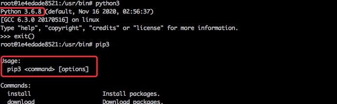
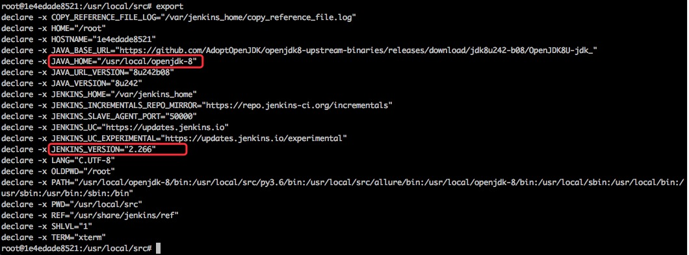

<!--
 * @Descripttion: 
 * @Author: zlj
 * @Date: 2020-05-22 13:40:42
-->
# Jenkins 镜像创建容器，并搭建 Python + Pytest +Allure 的自动化测试环境

## docker运行jenkins

1.docker pull jenkins/jenkins 拉镜像

2.mkdir -p /var/jenkins_node 在主机下创建一个目录用于挂载目录

3.chmod -R 777 /var/jenkins_node 给挂载目录一个最高权限

4.docker run -d -uroot -p 80:8080 --name jenkins1 -v /Users/test/Desktop/jenkins_node:/var/jenkins_home jenkins/jenkins （-v：目录映射 要用file sharing中有的目录）

5.docker exec -it -uroot jenkins1 bash 进入容器

## 准备
```
# 获取最新的软件包
apt-get update

# 升级已安装的软件包
apt-get upgrade

# 提前安装，以便接下来的配置操作
apt-get -y install gcc automake autoconf libtool make
apt-get -y install make*
apt-get -y install zlib*
apt-get -y install openssl libssl-dev
apt-get install sudo
```

## 安装python环境
```
1# cd /var/jenkins_home
2# mkdir python3
3# cd python3
4# wget https://www.python.org/ftp/python/3.6.8/Python-3.6.8.tgz
5# tar -xzvf Python-3.6.8.tgz
6# cd Python-3.6.8

make编译安装:

在/var/jenkins_home/python3/Python-3.6.8执行以下命令:
./configure --prefix=/var/jenkins_home/python3 --with-ssl
make
make install

添加软链接
添加python3软链接：
ln -s /var/jenkins_home/python3/bin/python3.6 /usr/bin/python3
添加pip3软链接：
ln -s /var/jenkins_home/python3/bin/pip3 /usr/bin/pip3
```
验证python3环境：


## 安装Allure环境

1.官网下载allure包：https://github.com/allure-framework/allure2/releases

2.从主机复制到容器内：docker cp allure-commandline-2.13.6.zip jenkins1:/usr/local/src

3.解压包：unzip allure-commandline-2.13.6.zip

4.重命名：mv allure-2.13.6 allure

5.赋最高权限chmod -R 777 allure

配置allure和py环境变量：
```
cat >> /root/.bashrc << "EOF" 
export PATH=/usr/local/src/allure/bin:$PATH 
export PATH=/usr/local/src/py3.6/bin:$PATH 
EOF
```
更新环境变量配置文件：
source /root/.bashrc

验证环境变量：

allure --version

python3 --version

配置jdk环境变量
export


配置JDK环境变量：
```
cat >> /root/.bashrc<< "EOF" 
export PATH=$JAVA_HOME/bin:$PATH 
EOF
```
更新环境变量配置文件：
source /root/.bashrc

参考博客：https://www.cnblogs.com/poloyy/p/13954637.html


