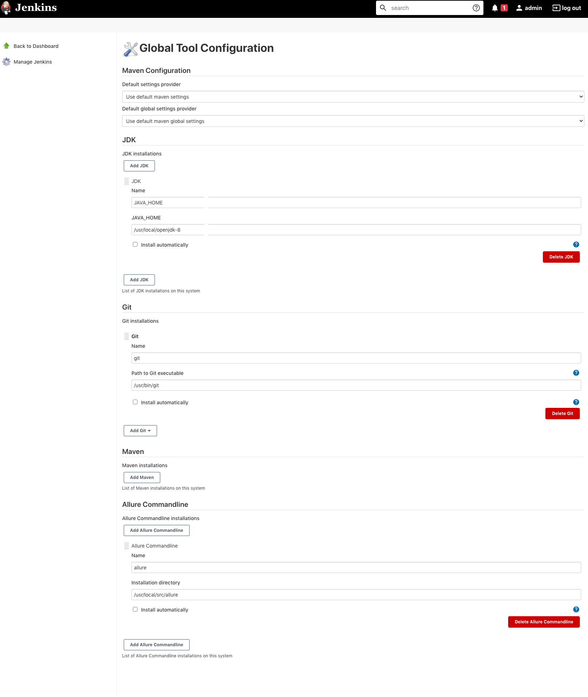
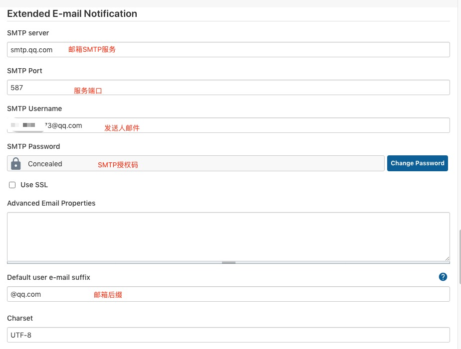
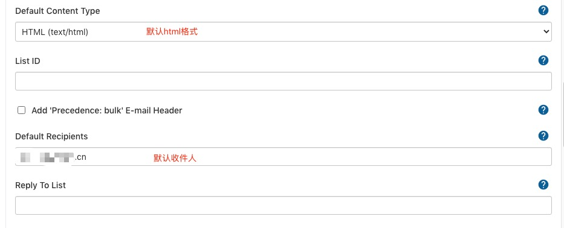
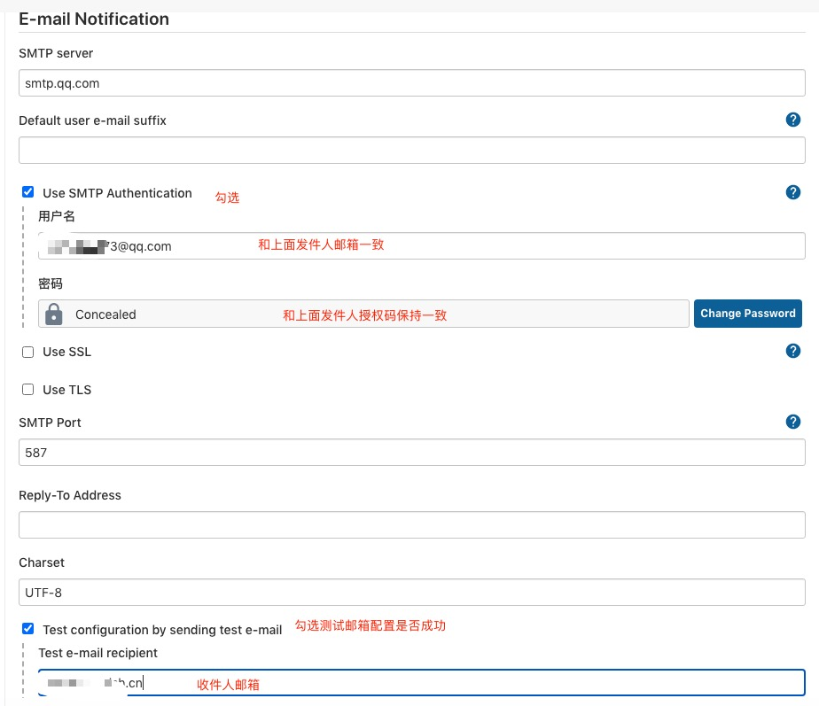
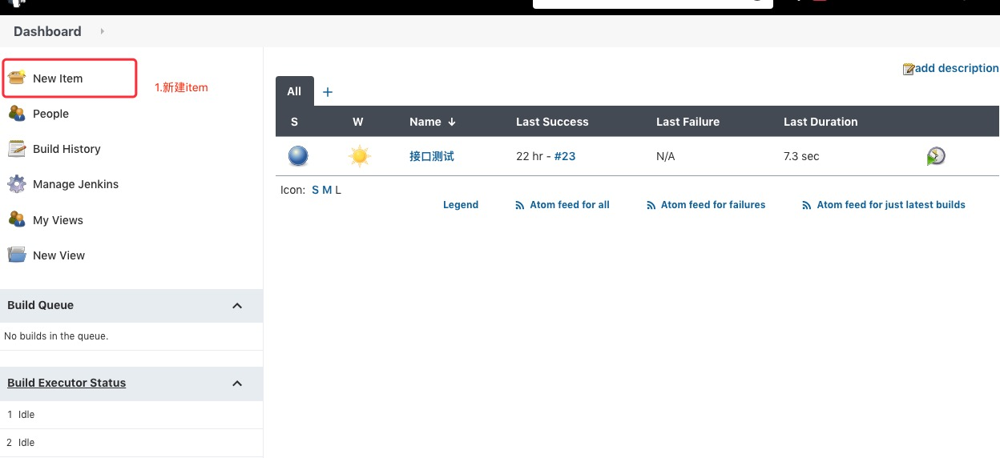
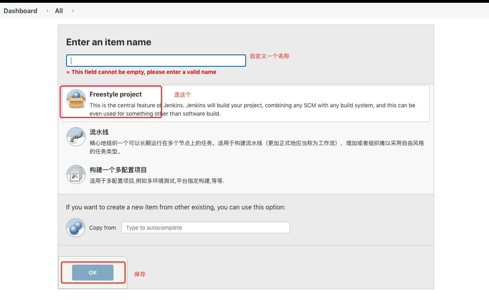
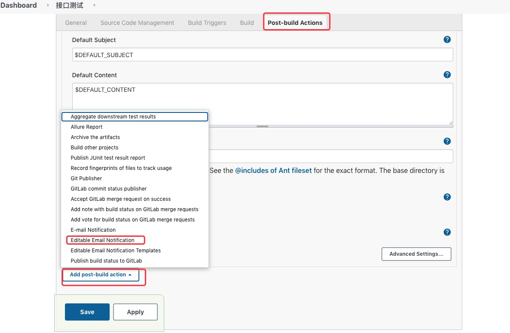
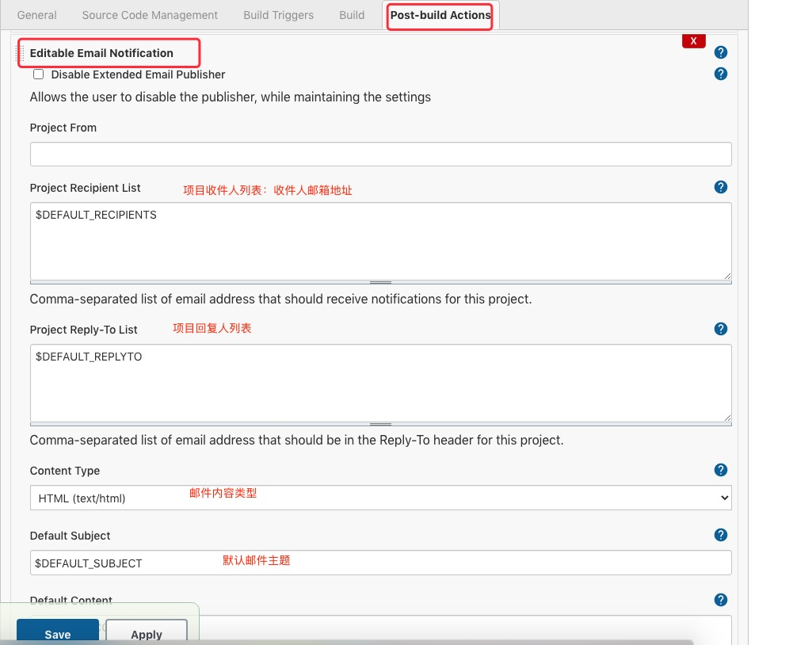
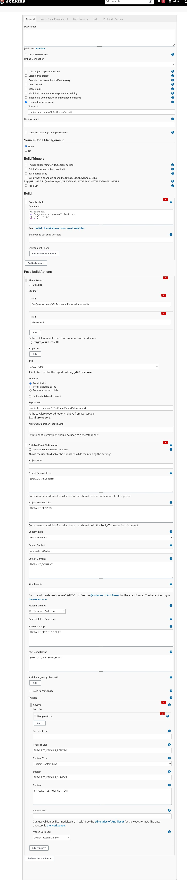
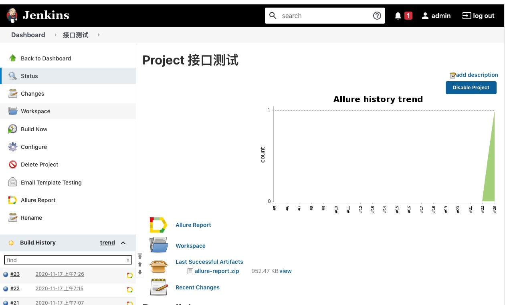

<!--
 * @Descripttion: 
 * @Author: zlj
 * @Date: 2020-11-18 10:11:16
-->
# 在 Jenkins 容器上的搭建持续集成环境和完成自动化测试
1.浏览器访问Jenkins http://ip:80

2.查看密码：docker logs jenkins1

3.初始化流程-->创建管理员用户-->实例配置

4.下载插件：
先修改镜像源：Manage Jenkins->Manage Plugins->advanced->Update Site
URL修改为：https://mirrors.tuna.tsinghua.edu.cn/jenkins/updates/update-center.json

修改配置文件：
```
cd /var/jenkins_home/update# 
sed -i 's#https://updates.jenkins.io/download#https://mirrors.tuna.tsinghua.edu.cn/jenkins#g' default.json && sed -i 's#http://www.google.com#https://www.baidu.com#g' default.json
```

在Available中勾选GitLab,Gitlab Hook;Email Extension,Email Extension Template;Allure;

点击Download now and install after restart

安装完成之后重启容器：docker restart jenkins1

5.全局工具设置：

Manage Jenkins-->Global Tool Configuration(配置JDK,Git,Allure)



## 配置邮件功能

Manage Jenkins -->Configure System

1.配置Extended E-mail Notification


2.邮件通知的默认收件人列表

3.配置E-mail Notification


## 使用Jenkins实现自动化测试

1.将项目放在到docker映射主机的目录：/Users/test/Desktop/jenkins_node/API_Testframe

2.验证项目容器内能正常跑cd/var/jenkins_home/API_Testframe

3.Jenkins创建任务工程




4.Jenkins任务配置构建后操作



5.对项目进行构建


参考博客：https://www.cnblogs.com/poloyy/p/13955641.html
