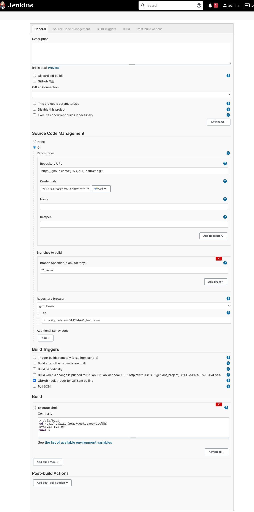

# Jenkins +Git 持续集成

1.配置github

wenhook地址：

webhook是通知Jenkins时的请求地址，用来填写到GitHub上，这样GitHub就能通过该地址通知到Jenkins；假设Jenkins所在服务器的地址是：192.168.0.1，端口为8080，那么webhook地址就是http://192.168.0.1:8080/github-webhook

2.生成Personal access tokens
github->settings->Developer settings->Personal access tokens->勾选repo和admin:repo_hook，生成token后复制保存，等会用

3.Jenkins配置

在"系统管理->管理插件"中安装GitHub Plugin插件

4.在系统管理-系统设置-配置GitHub Server：“API URL"填写"https://api.github.com”，“Credentials"位置，选择"Add->Jenkins”
弹出的页面中，“Kind"选择"Secret text”，"Secret"填入前面在GitHub上生成的Personal access tokens，Description随便写一些描述信息

5.建一个item后配置

选择"Git"；

"Repository URL"输入仓库地址：https://github.com/zlj1124/API_Testframe.git；

“Credentials"创建一个Credentials，Kind选择"Username with password”，
Username输入GitHub账号，Password输入GitHub密码；

“源码库浏览器"选择"githubweb”；

"URL"输入项目主页：https://github.com/zlj1124/API_Testframe；

“构建触发器"中勾选"GitHub hook trigger for GiTScm polling”；

博客参考：https://blog.csdn.net/boling_cavalry/article/details/78943061
