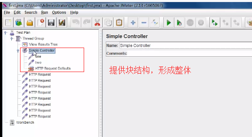
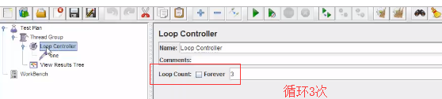
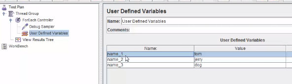
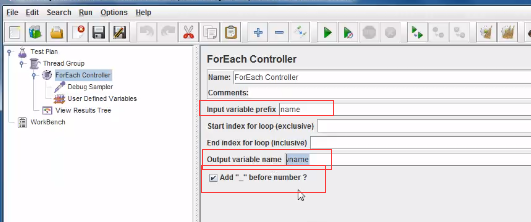
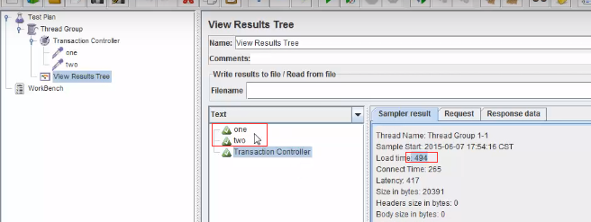
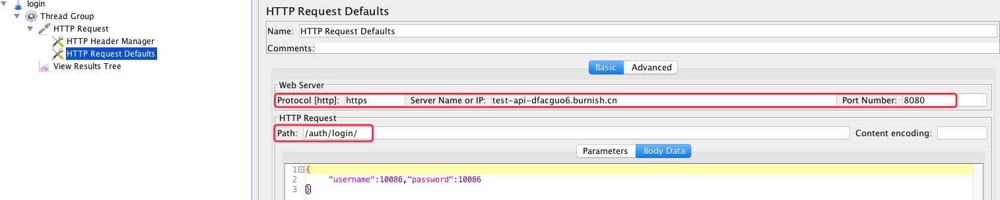
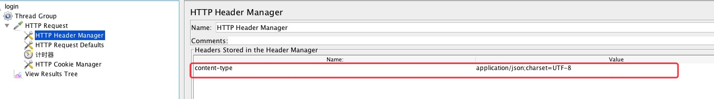
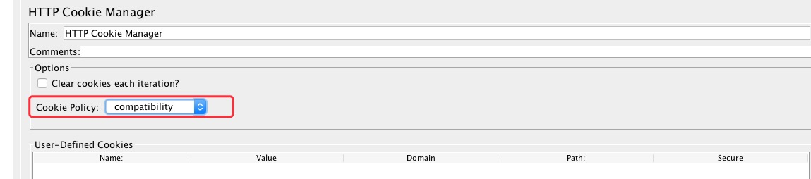
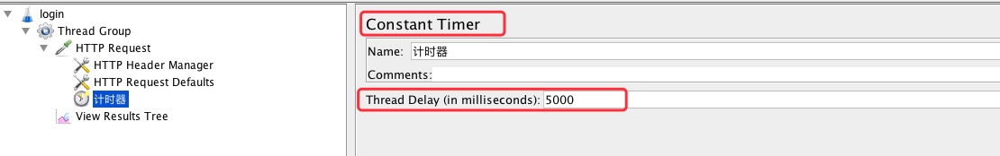
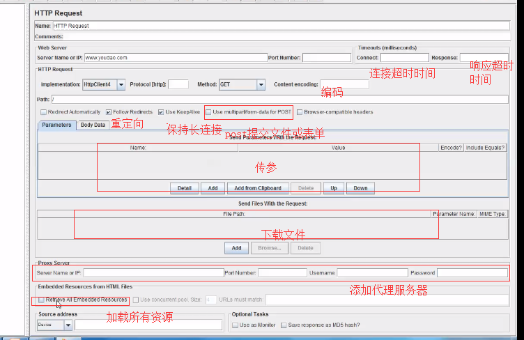

# 元件

## 执行顺序

1.逻辑控制器-->配置元件-->前置处理器-->定时器-->取样器-->后置处理器-->断言-->监听器

同级从上到下依次执行

## 常用逻辑控制器

### 简单控制器：提供块结构，形成整体

### Loop Controler:循环控制器

### ForEach Conteoller:

ForEach Conteoller和UDV绑定使用

1）定义变量

2）通过foreach取值

### Transaction Controller事务控制器：

用于计算响应时间

## 1.常用配置元件

### 默认请求元件

添加一次，若平级所有采用器都默认使用，或只作用于某一个采样器

注：HTTP requeset default元件参数与采样器请求参数相同，则请求参数合并a=1,a=2

http请求本身值和http请求默认值的优先级顺序：

1.HTTP 请求本身设置的值

2.HTTP 请求下的 HTTP 请求默认值设置的值

3.线程组下的 HTTP 请求默认值设置的值

### header管理器

注：同级目录下以manager结尾的只能一个

### cookie管理器

自动接收发送cookie值

注：每个线程cookie独立,自定义是共享的

## 计时器

## 采样器

