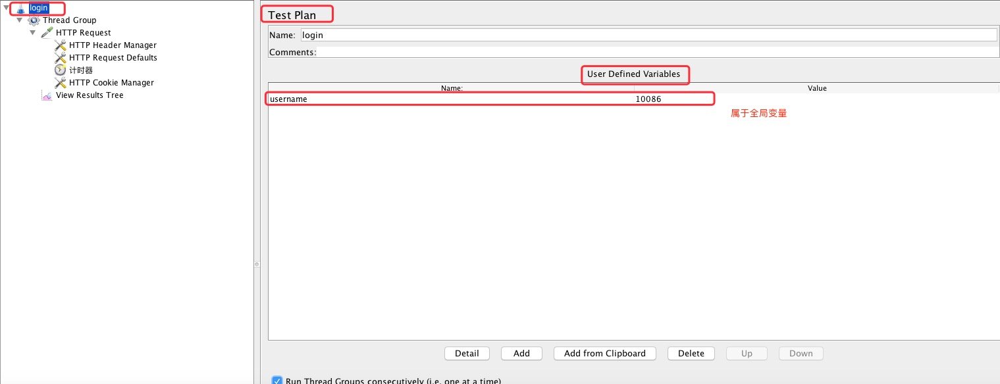

<!--
 * @Descripttion: 
 * @Author: zlj
 * @Date: 2020-07-24 10:27:27
--> 

# 变量

### 一.testplan中全局变量：



### 二.User Defined Variables 用户自定义全局变量：

1）线程组右键添加-->配置元件-->用户定义的变量，出现如下设置页面后

2）然后将设置后的变量名称，在登录请求中进行参数化引用${user}、${pass}


### 三.函数助手获取参数值:

1)选择菜单栏 选项-->函数助手对话框，弹出函数助手框，功能下面有多个函数可供选择，我们主要看下__RandomString。

2）要进行多个账号注册（比如10个用户），注册信息要求手机号mobilephone不能重复；所以可以这么来思考，手机号前3位号段固定，那就对手机号后8位进行随机，页面设置如下


3)拷贝生成的函数字符串，粘贴进行参数引用


### 四.CSV Data Set Config获取参数值:

1）读取在本地txt或者CSV文件（CSV文件默认逗号隔开）


2）线程组右键添加-->配置元件-->CSV Data Set Config


```.bash
Filename：需要传入文件的完整路径。我的文件位于D盘目录下，文件名为users.txt。

File encoding：参数文件的编码格式。可以不填。

Variable Names：对应参数文件中每列的变量名，也是你要引用到请求中的参数变量名。这里第一列是手机号、第二列是昵称。变量名可以自定义。

igonre first line(only used if Variable Names is not empty):当 CSV 文件中首行设置了变量名时，该项设为 true，此时每次请求读取文件时会自动忽略首行，直接读取第二行的数据。若首行未设置，则选择False

Delimiter：文件中的分隔符，默认英文的逗号分隔。所以注意txt文档中每行多个参数用英文逗号分隔。

Recycle on EOF: 设置为True后,允许重头循环取值；为False，当读取文件到结尾时，停止读取文件

Stop Thread EOF: 当Recycle on EOF为false并且Stop Thread EOF 为true,则读完csv文件中的记录后,停止运行，线程数及执行次数无效。

Sharing Mode:共享模式。

All threads：所有线程，所有线程循环取值，线程1取第一行，线程2取下一行；

Current thread group：当前线程组，各个线程组分别循环取值；Current thread：当前线程，该测试计划内的所有线程都取第一行。
```

3）直接参数化引用


Debug Sampler调试：显示所有变量


