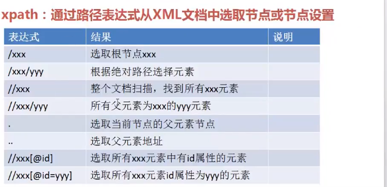

# selenium使用

## 元素定位

from selenium.webdriver.common.by import By

### 1.通过id来查找
```bash
driver.find_element_by_id('kw')
driver.find_element(By.ID,'kw')
```
### 2.通过类名来查找
```bash
cheeses = driver.find_elements_by_class_name("cheese")
cheeses = driver.find_elements(By.CLASS_NAME, "cheese")
```
### 3.通过name属性查找
```bash
driver.find_elements_by_name("email")
driver.find_elements(By.NAME,'email')
```
### 4.通过标签名查找
```bash
driver.find_elements_by_tag_name('div')
driver.find_elements(By.TAG_NAME,'kw')
```
### 5.通过xpath 语法查找
```bash
driver.find_elements_by_xpath("//div")
driver.find_elements(By.XPATH,'//div')
```

```bash
input_search = driver.find_element_by_xpath("//*[@id='kw']") //通过元素id查找元素
input_search = driver.find_element_by_xpath("//*[@name='wd']") //通过元素name查找元素
input_search = driver.find_element_by_xpath("//*[@class='s_ipt']") //通过元素class查找元素
input_search = driver.find_element_by_xpath("//*[@maxlength='255']") //通过其他属性查找元素
前面*号表示查找所有的标签元素，可以替换为标签名称更准确的定位元素：
input_search = driver.find_element_by_xpath("//input[@id='kw']") //通过元素id查找元素

xpath层级定位
input_search = driver.find_element_by_xpath("//input[@id='form']//span[1]//input")

模糊匹配元素的属性
news = driver.find_element_by_xpath("//a[contains(text(), '新闻')]") //查找text中包含"新闻"的元素
input_search = driver.find_element_by_xpath("//input[contains(@id, 'kw']") //查找id中包含"kw"的元素
input_search = driver.find_element_by_xpath("//input[starts-with(@id, 'k']") //查找id以"k"开头的元素
input_search = driver.find_element_by_xpath("//input[ends-with(@id, 'w']") //查找id以"w"结尾的元素
input_search = driver.find_element_by_xpath("//input[matchs(@id, 'k*']") //利用正则表达式查找元素
```

### 6.通过css选择器选择元素

```bash
driver.find_elements_by_css_selector("//div")
driver.find_elements(By.CSS_SELECTOR,'//div')
```

```bash
css属性使用id定位时'#'表示元素的id
input_search = driver.find_element_by_css_selector("#kw") //使用元素的id定位

css使用class定位时，使用'.'表示元素的class
input_search = driver.find_element_by_css_selector(".s_ipt") //使用元素的class定位

css使用tagName定位，直接使用元素标签
input_search = driver.find_element_by_css_selector("input") //使用元素的tagName定位

css使用元素的其他属性定位：
input_search = driver.find_element_by_css_selector("[maxlength='255']") //使用元素的maxlength属性定位
input_search = driver.find_element_by_css_selector("[autocomplete='off']") //使用元素的autocomplete属性定位

可以在参数中加入元素的标签名称：
input_search = driver.find_element_by_css_selector("input#kw") //使用元素的id定位
input_search = driver.find_element_by_css_selector("input.s_ipt") 

组合多个属性定位元素
input_search = driver.find_element_by_css_selector("input[id='kw'][name='wd']")

find_element  获取第一个满足条件的元素
find_elements 获取所有满足条件的元素
```

### 7.使用link_text定位
```bash
el=driver.find_element_by_link_text("新闻")
```
### 8.使用partial_link_text定位
```bash
这种方式类似于link_text的定位方式，如果一个元素的文本过长，就不需要使用文本的所有信息，可以使用其中的部分文本就可以定位
news = driver.find_element_by_link_text("新闻") //使用全部文本
news = driver.find_element_by_partial_link_text("新") //使用部分文本
```

## 获取元素标签文本

```.bash
# 获取第一个标签为a的文本
a_text = driver.find_element_by_tag_name("a")
print(a_text.text)

```
## 获取元素的属性值

```.bash
# 获取元素属性值
a_attr = driver.find_element_by_class_name("mnav")
print(a_attr.get_attribute("href"))
```
## 表单元素操作

```bash
1.button 
input[type='submit']
2.checkbox  
input[type='checkbox ']
3.select 下拉列表
-----------
input_tag=driver.find_element_by_id('kw')
input_tag.send_keys("onion")  #填充
input_tag.clear()  #清除
-----------
remember_tag = driver.find_element_by_id('rememberME')
remember_tag.click()  #点击
-------------------
```

## 选择标签

```bash
选择select ： select 元素不能直接点击。因为点击后还需要选中元素
<select> </select>

# 导入 Select 类
from selenium.webdriver.support.ui import Select

#找到 name 的选项卡
select_tag = Select(driver.find_element_by_name('status'))

select_tag.select_by_index(1) #索引
select_tag.select_by_value("0") #根据value里的值
select_tag.select_by_visible_text("广播") #根据文本内容
select_tag.deselect_all()  #取消所有的选中
 ```

 ## 检查元素是否可见/可点击/被选中
 
 ```.bash
 ant_btn4 = driver.find_element_by_class_name("ant-btn4")
 print("可见元素:", ant_btn4.is_displayed())
 print("可点击元素:", ant_btn4.is_enabled())
 print("已被选择元素:",ant_btn4.is_selected())
 ```

