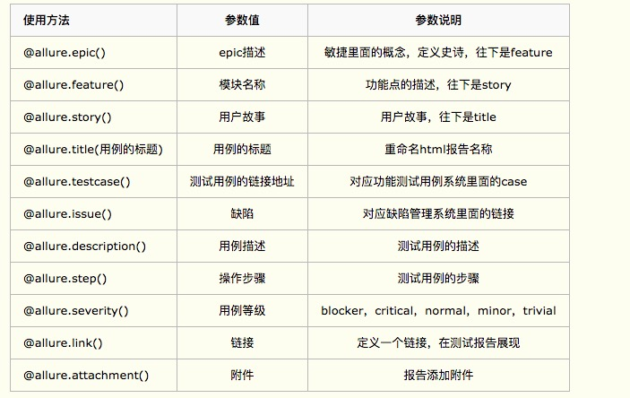
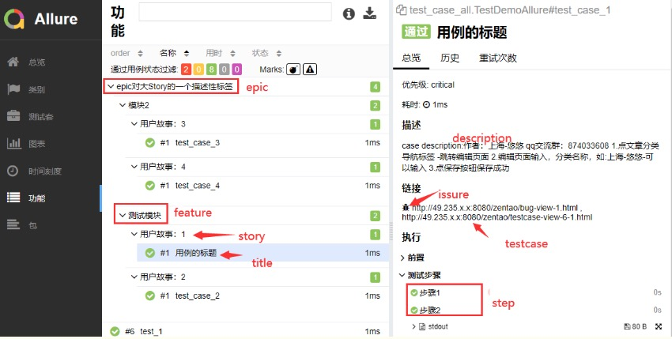

# allure

## 安装

pip install  allure-pytest

生成测试报告的原始文件：
pytest --alluredir ./report/allure_raw

打开html的报告需要启动allure服务：
allure serve report/allure_raw

## allure用例描述


@allure.step("步骤3")用在fixture里面或者用例每个步骤的函数

## 用例等级

allure对用例的等级划分成五个等级

blocker　 阻塞缺陷（功能未实现，无法下一步）

critical　　严重缺陷（功能点缺失）

normal　　 一般缺陷（边界情况，格式错误）

minor　 次要缺陷（界面错误与ui需求不符）

trivial　　 轻微缺陷（必须项无提示，或者提示不规范）

```.bash
import allure

@allure.epic("epic对大Story的一个描述性标签")
@allure.feature("验证xx功能")
class TestArticleclassify():
    '''验证xx功能'''
    @allure.severity("normal") //用例等级
    @allure.story("用例标题")
    @allure.issue("http://49.235.92.12:8080/zentao/bug-view-1.html")  # 禅道bug地址
    @allure.testcase("http://49.235.92.12:8080/zentao/testcase-view-5-1.html")  # 禅道用例连接地址
    def test_edit_classify5(self, login):
        '''用例描述：具体步骤'''
        setup: 登录login
        step1: 1
        step2: 2
        step3: 3
        
        '''
        driver = login
        edit = ArticleclassifyPage(driver)
        edit.click_classify_nav()
        edit.edit_classify("计算机")
        res2 = edit.is_edit_classify_success("计算机")
        print("编辑是否成功：%s"%res2)
        assert res2  # 断言
```



## 参数化(parametrize)结合allure.title()生成不同标题报告

```.bash
import pytest
import allure


def login(username, password):
    '''登录'''
    print("输入账号：%s" % username)
    print("输入密码：%s" % password)
    # 返回
    return {"code": 0, "msg": "success!"}


# 测试数据
test_datas = [
    ({"username": "yoyo1", "password": "123456"}, "success!", "输入正确账号，密码，登录成功"),
    ({"username": "yoyo2", "password": "123456"}, "failed!", "输入错误账号，密码，登录失败"),
    ({"username": "yoyo3", "password": "123456"}, "success!", "输入正确账号，密码，登录成功"),
]


@allure.story("登录用例")
@allure.title("{title}")
@pytest.mark.parametrize("test_input,expected,title",
                         test_datas
                         )
def test_login(test_input, expected, title):
    '''测试登录用例'''
    # 获取函数返回结果
    result = login(test_input["username"], test_input["password"])
    # 断言
    assert result["msg"] == expected
```

## 命令行运行参数

选择运行你要执行epic的用例

pytest --alluredir ./report/allure --allure-epics=epic对大Story的一个描述性标签

选择运行你要执行features的用例

pytest --alluredir ./report/allure --allure-features=模块2

选择运行你要执行features的用例

pytest --alluredir ./report/allure --allure-stories="用户故事：1"