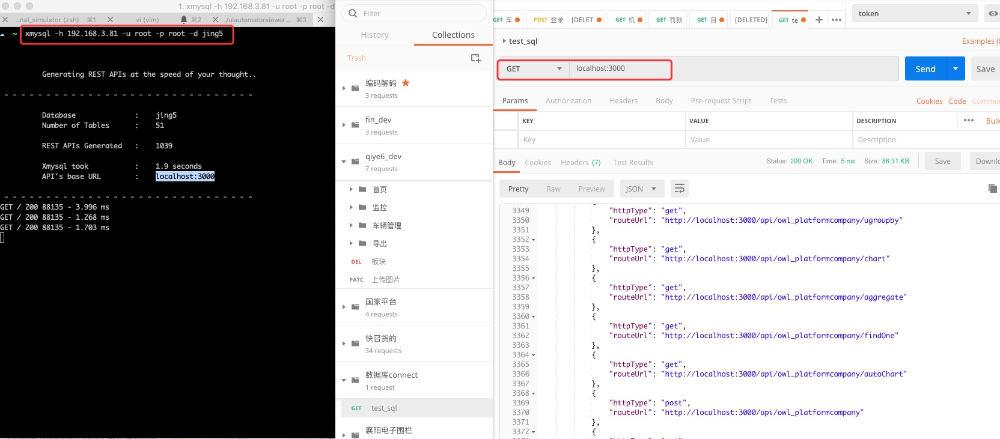
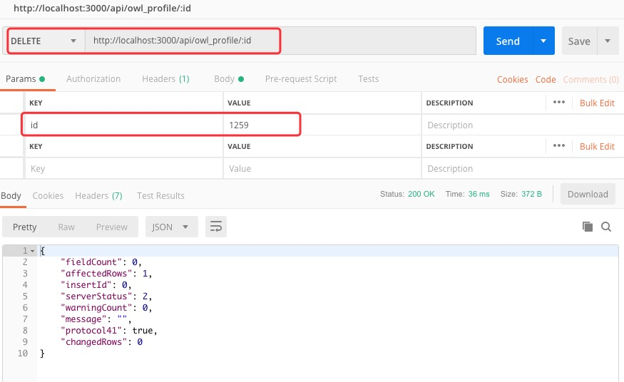
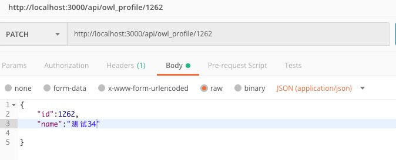
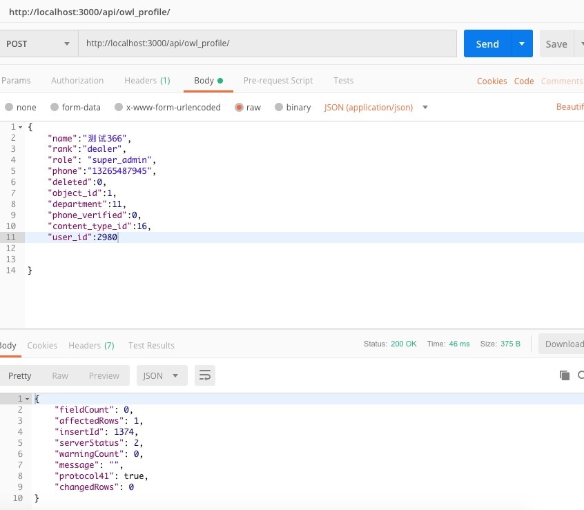

# postman连接数据库

命令行安装xmysql：npm install xmysql -g

连接数据库的命令：xmysql -h localhost -u mysqlUser -p mysqlPassword -d databaseName



## 查询

```
[GET]
http://localhost:3000/api/owl_profile?_where=(name,eq,李)
```

## 删除
```
[DELETE]
http://localhost:3000/api/owl_profile/:id
```


## 修改
```
[PATCH]
http://localhost:3000/api/owl_profile/1262
```


## 插入
```
[POST]

```
