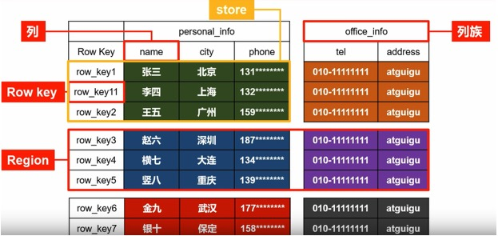

# hbase基本操作

hbase是一种分布式，可扩展，支持海量数据存储的nosql数据库



```.bash
查询：
单条数据：
get 表名，rowkey，列族：列名 
get 'guo6_obd_info','LGHHFV19MHAL0069K__2019-10-21 09:43:55','A:c01'

多条数据：
scan 表名，{STARTROW=>"a",STOPROW=>"b"}
scan "guo6_obd_info", {STARTROW=>"LGHB2V190FK200012__2018-05-24 00:00:00", STOPROW=>"LGHB2V190FK200012__2019-09-10 00:00:00"}

启动：hbase shell

create '表名', '列族'# HBase 新建表时，至少需要一个列族

查看数据库表：list

查看数据库表属性：describe "表名"

删除表：
disable "表名"
drop "表名"

插入：
put '表名','rowkey','列族:列名','值'

获取单条数据：
get '表名','rowkey',{COLUMN=>'列族:列名'}

查询多条数据：
scan '表名',{STARTROW=>"a"，STOPROW=>"b"}

删除单元格数据：
delete '表名','rowkey','列族:列名'

删除整行数据：
deleteall '表名','rowkey'

获取帮助：
help

```