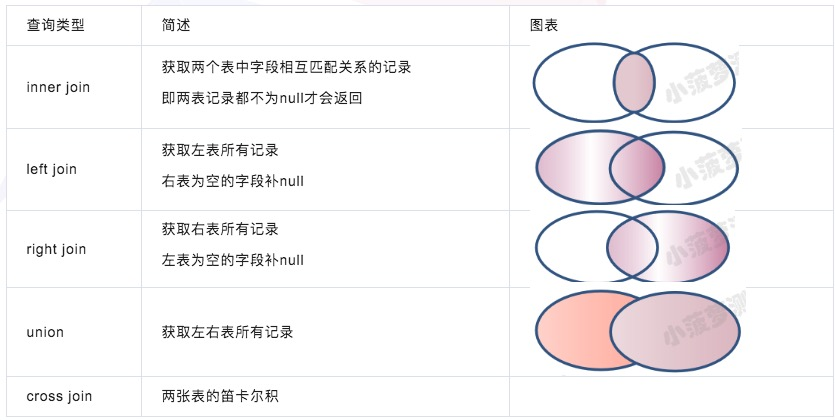
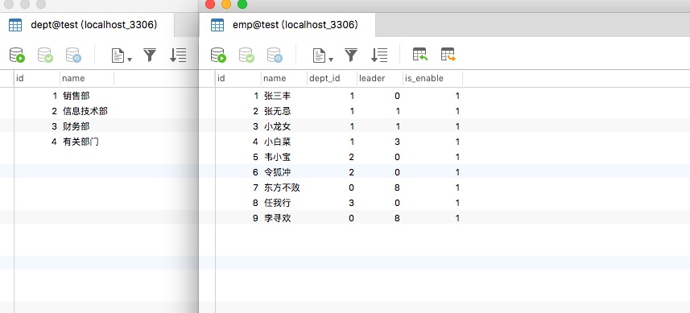
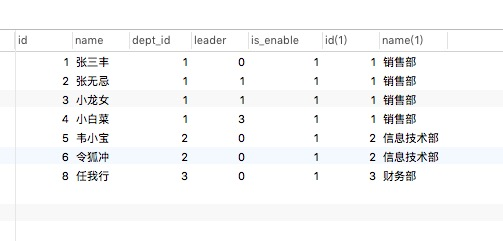
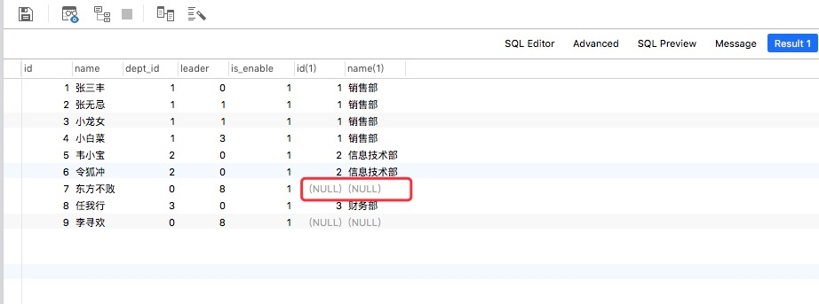
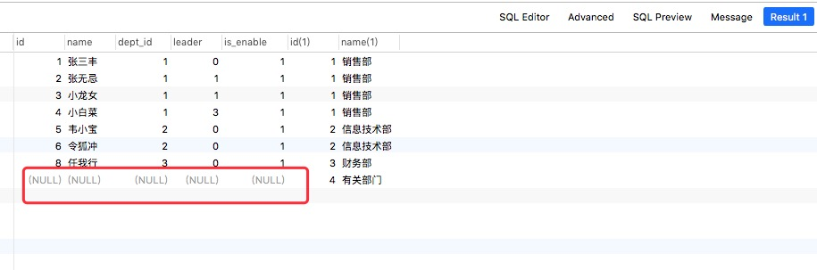
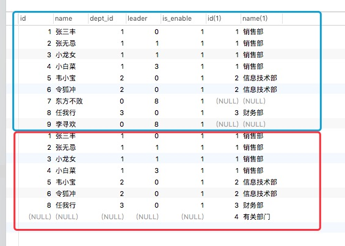
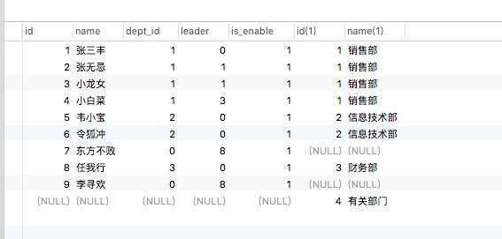

<!--
 * @Descripttion: 
 * @Author: zlj
 * @Date: 2020-08-17 10:34:57
-->
# 多表查询

## 多表查询的区别



## cross join：交叉连接（笛卡尔积）


```
SELECT <字段名> FROM <表1> CROSS JOIN <表2> [WHERE]
SELECT <字段名> FROM <表1>, <表2> [WHERE子句] 
select * from emp as a cross join dept as b on a.dept_id = b.id;
```


## inner join：内连接

只有两张表相互匹配到的数据才会返回（满足查询条件的数据），简单理解就是：取交集
```
SELECT <字段名> FROM <表1> INNER JOIN <表2> [ON子句]
select * from emp as a inner join dept as b on a.dept_id = b.id;
select * from emp as a join dept as b on a.dept_id = b.id;
inner join 也可以只写 join 不加 inner 
结果和cross jion一样
```

## 外连接

### left join：左外连接

外连接会返回主表的所有数据，无论在从表是否有与之匹配的数据，若从表没有匹配的数据则默认为空值（NULL）
```
SELECT <字段名> FROM <表1主表> LEFT JOIN <表2> <ON子句>
SELECT <字段名> FROM <表1> RIGHT JOIN <表2主表> <ON子句>
select * from emp as a left join dept as b on a.dept_id = b.id;

left jion +where
select * from emp as a left join dept as b on a.dept_id = b.id where b.id is null;
如果外连接中有 where 关键字，on是为了关联两张表，而where是将外连接查询的结果集进行条件筛选
所以执行顺序是：on  -》 join -》 where
on：筛选两张表可以进行连接数据
join：将筛选后的数据连接起来
where：将连接后的数据结果集再次条件筛选
```

### right join：右外连接

select * from emp as a right join dept(主表) as b on a.dept_id = b.id;


## union、union all：全连接


 union all:
select * from emp as a left join dept as b on a.dept_id = b.id
union all
select * from emp as a right join dept as b on a.dept_id = b.id;


union（去重）:

select * from emp as a left join dept as b on a.dept_id = b.id
union
select * from emp as a right join dept as b on a.dept_id = b.id;


## 子查询

```

比较运算符的栗子：
查询部门是销售部的员工信息
select * from emp where dept_id = (select id from dept where name = "销售部")

in的栗子：
从 dept 表查询部门名字为销售部or财务部的部门 id，然后从 emp 表查询 depte_id 在上面 id 结果集的记录
select * from emp where dept_id in (select id from dept where name = "财务部" or name ="销售部")


not in 的栗子：
select * from emp where dept_id not in (select id from dept where name = "财务部" or name ="销售部")


exists栗子：
select * from emp where exists(select * from dept where id = 1)

exists+加其他查询条件的栗子：
select * from emp where exists (select * from dept where id = 1) and dept_id = 2


any栗子：
select * from emp where d_id !=any(select d_id from department)

all栗子：
select * from emp where d_id>=all(select d_id from department)

临时表栗子：
select  a.id, a.name, c.avg_score 
from student a,
(select b.id, avg(b.score) as avg_score 
from grade  b
group by b.id
)c
where a.id = c.id
```


